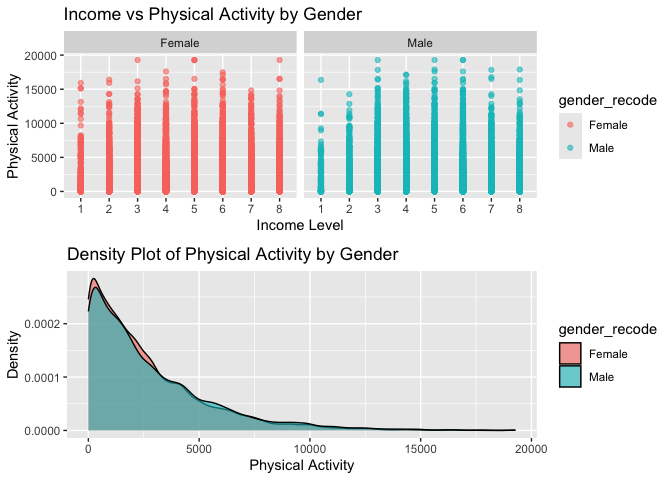
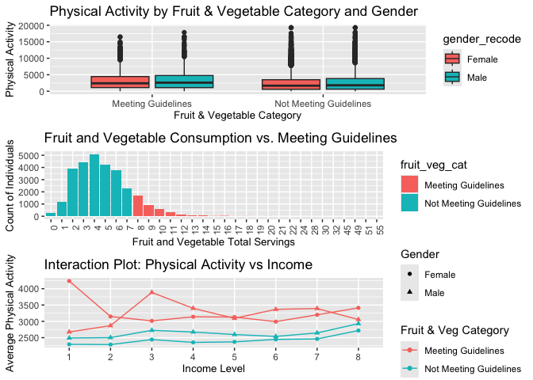
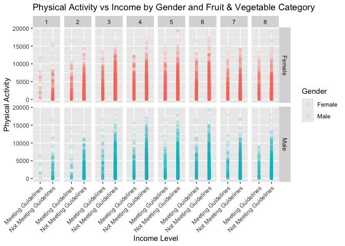

``` r
library(rstatix)
library(tidyverse)
library(pastecs)
library(knitr)
library(epitools)
library(Epi)
options(scipen=999) 
library(readr)
library(gridExtra)
```


``` r
# Function for calculating statistics
calculate_statistics <- function(data, column_name) {
  column_data <- data[[column_name]]
  mean_value <- mean(column_data, na.rm = TRUE)
  median_value <- median(column_data, na.rm = TRUE)
  variance_value <- var(column_data, na.rm = TRUE)
  sd_value <- sd(column_data, na.rm = TRUE)
  
  mode <- function(x) { 
    ux <- unique(x)
    ux[which.max(tabulate(match(x, ux)))]
  }
  mode_value <- mode(column_data)
  
  cat("Statistics for column:", column_name, "\n")
  cat("Mean:", mean_value, "\n")
  cat("Median:", median_value, "\n")
  cat("Mode:", mode_value, "\n")
  cat("Variance:", variance_value, "\n")
  cat("Standard Deviation:", sd_value, "\n")
}
```

# Assignment Introduction

**Assignment Goal:** Transform raw datasets into a format ready for analysis, draw meaningful insights using descriptive statistics, and present findings visually.

**Assignment Objectives:**

-  Develop skills in cleaning and preprocessing raw data, including handling inconsistent data.

-  Conduct exploratory data analysis using descriptive statistics.

-  Integrate multiple datasets by performing joins and ensuring consistency in the merged data.

-  Create meaningful visualizations to summarize and communicate your findings.

# Data Cleaning

## Load the provided datasets and examine their structure.


``` r
# Load datasets
data_demographics <- read_csv("can_path_demographics.csv")
data_health <- read_csv("can_path_health.csv")

# Check dimensions and missing data
cat("Demographics data: ", ncol(data_demographics), "columns, ", nrow(data_demographics), "rows, ",
    sum(is.na(data_demographics)), "missing values.\n")
```

```
## Demographics data:  3 columns,  41187 rows,  5934 missing values.
```

``` r
cat("Health data: ", ncol(data_health), "columns, ", nrow(data_health), "rows, ",
    sum(is.na(data_health)), "missing values.\n")
```

```
## Health data:  6 columns,  41187 rows,  13638 missing values.
```

## Check missing values


``` r
# Check how much missing data exists in each variable.
colSums(is.na(data_demographics))
```

```
##         ID SDC_GENDER SDC_INCOME 
##          0          0       5934
```

``` r
colSums(is.na(data_health))
```

```
##              ID   HS_GEN_HEALTH     NUT_VEG_QTY  NUT_FRUITS_QTY  PA_TOTAL_SHORT 
##               0             672            2549            2426            6763 
## DIS_ASTHMA_EVER 
##            1228
```
## Examine structure of the dataset


``` r
str(data_demographics)
```

```
## spc_tbl_ [41,187 × 3] (S3: spec_tbl_df/tbl_df/tbl/data.frame)
##  $ ID        : chr [1:41187] "SYN_58621" "SYN_58622" "SYN_58623" "SYN_58624" ...
##  $ SDC_GENDER: num [1:41187] 2 2 2 2 2 2 2 2 2 2 ...
##  $ SDC_INCOME: num [1:41187] 6 6 4 3 NA 4 5 3 3 5 ...
##  - attr(*, "spec")=
##   .. cols(
##   ..   ID = col_character(),
##   ..   SDC_GENDER = col_double(),
##   ..   SDC_INCOME = col_double()
##   .. )
##  - attr(*, "problems")=<externalptr>
```

``` r
str(data_health)
```

```
## spc_tbl_ [41,187 × 6] (S3: spec_tbl_df/tbl_df/tbl/data.frame)
##  $ ID             : chr [1:41187] "SYN_58621" "SYN_58622" "SYN_58623" "SYN_58624" ...
##  $ HS_GEN_HEALTH  : num [1:41187] 3 4 3 4 3 5 5 3 3 4 ...
##  $ NUT_VEG_QTY    : num [1:41187] 3 0 5 1 2 5 3 5 8 1 ...
##  $ NUT_FRUITS_QTY : num [1:41187] 1 0 3 3 3 5 3 2 5 0 ...
##  $ PA_TOTAL_SHORT : num [1:41187] 3564 0 NA 594 NA ...
##  $ DIS_ASTHMA_EVER: num [1:41187] 0 0 2 0 1 2 0 NA 0 0 ...
##  - attr(*, "spec")=
##   .. cols(
##   ..   ID = col_character(),
##   ..   HS_GEN_HEALTH = col_double(),
##   ..   NUT_VEG_QTY = col_double(),
##   ..   NUT_FRUITS_QTY = col_double(),
##   ..   PA_TOTAL_SHORT = col_double(),
##   ..   DIS_ASTHMA_EVER = col_double()
##   .. )
##  - attr(*, "problems")=<externalptr>
```
- **SDC_GENDER:** Gender of the participant.

- **SDC_INCOME:** Average annual income, before taxes, of the participant's entire household including salaries, pensions, and allowances.

- **HS_GEN_HEALTH:** Participant's general perception of his/her health.

- **NUT_VEG_QTY:** Total number of vegetable servings (about 1/2 cup or 125mL) consumed in a typical day.

- **NUT_FRUITS_QTY:** Total number of fruit servings (about 1/2 cup) consumed in a typical day.

- **DIS_ASTHMA_EVER:** Occurrence of asthma at any point during the life of the participant.

- **PA_TOTAL_SHORT:** Quantitative indicator of global physical activity in metabolic equivalent (MET)-minutes per week (IPAQ short form).Total physical activity MET-minutes/week = sum of Walking + Moderate + Vigorous MET-minutes/week scores

## Variable transformations

### Converting variables to factor

``` r
cols <- c("SDC_INCOME")

data_demographics <- data_demographics %>% 
  mutate_at(cols,factor)

cols_health <- c("HS_GEN_HEALTH")

data_health <- data_health %>% 
  mutate_at(cols_health,factor)
```


### Recode and label categorical variables as necessary


``` r
# Recode gender
# The `SDC_GENDER` variable is numeric (1 for Male, 2 for Female), which is not intuitive for analysis.
# Recode the numeric gender variable into descriptive categories ("Male" and "Female") for better interpretability.
data_demographics <- data_demographics %>%
  mutate(gender_recode = case_when(
    SDC_GENDER == 1 ~ "Male",
    SDC_GENDER == 2 ~ "Female"
  ))

# Recode income levels
# The `SDC_INCOME` variable uses numeric codes to represent income ranges.
# Recode these numeric values into descriptive text labels to improve clarity and allow for meaningful analysis of income-related trends.
data_demographics <- data_demographics %>%
  mutate(income_recode = case_when(
    SDC_INCOME == 1 ~ "1_Less than 10 000 $",
    SDC_INCOME == 2 ~ "2_10 000 $ - 24 999 $",
    SDC_INCOME == 3 ~ "3_25 000 $ - 49 999 $",
    SDC_INCOME == 4 ~ "4_50 000 $ - 74 999 $",
    SDC_INCOME == 5 ~ "5_75 000 $ - 99 999 $",
    SDC_INCOME == 6 ~ "6_100 000 $ - 149 999 $",
    SDC_INCOME == 7 ~ "7_150 000 $ - 199 999 $",
    SDC_INCOME == 8 ~ "8_200 000 $ or more"
  ))

# Convert the recoded gender variable into a factor
# Converting `gender_recode` into a factor allows for categorical analysis, such as creating grouped summaries or visualizations.
data_demographics$gender_recode <- as.factor(data_demographics$gender_recode)

# Combine vegetable and fruit servings
# The `NUT_VEG_QTY` and `NUT_FRUITS_QTY` variables capture the daily servings of vegetables and fruits, respectively.
# Combine these into a single variable `fruit_veg_tot` to measure the total servings of fruits and vegetables per day.
data_health <- data_health %>%
  mutate(fruit_veg_tot = NUT_VEG_QTY + NUT_FRUITS_QTY)

# Categorize fruit and vegetable consumption
# Create a categorical variable `fruit_veg_cat` based on the combined servings.
# Define thresholds for meeting or not meeting the recommended guidelines of 7+ servings per day.
# This allows for easier comparison and interpretation of dietary patterns.
data_health <- data_health %>%
  mutate(fruit_veg_cat = case_when(
    fruit_veg_tot <= 7  ~ "Not Meeting Guidelines",
    fruit_veg_tot > 7 ~ "Meeting Guidelines"
  ))

# Categorize physical activity levels
# The `PA_TOTAL_SHORT` variable represents the total physical activity in MET-minutes per week.
# Create a categorical variable `pa_cat` to group participants into low, moderate, and high activity levels based on predefined thresholds:
#   - Low: <600 MET-minutes/week
#   - Moderate: 600-2999 MET-minutes/week
#   - High: 3000+ MET-minutes/week
# This classification helps identify trends in physical activity levels across demographic groups.
data_health <- data_health %>%
  mutate(pa_cat = case_when(
    PA_TOTAL_SHORT < 600  ~ "Low Activity",
    PA_TOTAL_SHORT >= 3000 ~ "High Activity",
    PA_TOTAL_SHORT >= 600 ~ "Moderate Activity"
  ))
```

# Joining Datasets

## Combine two related datasets by performing appropriate join operations.


``` r
# Merge health and demographic data by ID
data <- left_join(data_health,data_demographics, by=join_by(ID))
head(data)
```

```
## # A tibble: 6 × 13
##   ID     HS_GEN_HEALTH NUT_VEG_QTY NUT_FRUITS_QTY PA_TOTAL_SHORT DIS_ASTHMA_EVER
##   <chr>  <fct>               <dbl>          <dbl>          <dbl>           <dbl>
## 1 SYN_5… 3                       3              1           3564               0
## 2 SYN_5… 4                       0              0              0               0
## 3 SYN_5… 3                       5              3             NA               2
## 4 SYN_5… 4                       1              3            594               0
## 5 SYN_5… 3                       2              3             NA               1
## 6 SYN_5… 5                       5              5             NA               2
## # ℹ 7 more variables: fruit_veg_tot <dbl>, fruit_veg_cat <chr>, pa_cat <chr>,
## #   SDC_GENDER <dbl>, SDC_INCOME <fct>, gender_recode <fct>,
## #   income_recode <chr>
```


# Descriptive Statistics

## Calculate key statistics.


``` r
# Calculate key statistics for total fruit and vegetable consumption
# It helps summarize the overall consumption of fruits and vegetables in the dataset.
calculate_statistics(data, "fruit_veg_tot")
```

```
## Statistics for column: fruit_veg_tot 
## Mean: 4.815695 
## Median: 4 
## Mode: 4 
## Variance: 6.963863 
## Standard Deviation: 2.638913
```


``` r
# Calculate key statistics for total physical activity
# It provides insights into the distribution of total physical activity (measured in MET-minutes per week).
calculate_statistics(data, "PA_TOTAL_SHORT")
```

```
## Statistics for column: PA_TOTAL_SHORT 
## Mean: 2574.089 
## Median: 1782 
## Mode: NA 
## Variance: 7055340 
## Standard Deviation: 2656.189
```


``` r
# Create a frequency table for gender distribution
# The `table()` function counts the number of participants in each gender category (`gender_recode`).
# The `prop.table()` function converts these counts into proportions, allowing for a percentage-based interpretation.
table_gender <- table(data$gender_recode)
prop.table(table_gender)
```

```
## 
##    Female      Male 
## 0.6309515 0.3690485
```


``` r
# Create a frequency table for income distribution
table_income <- table(data$income_recode)
prop.table(table_income)
```

```
## 
##    1_Less than 10 000 $   2_10 000 $ - 24 999 $   3_25 000 $ - 49 999 $ 
##              0.01338893              0.05630726              0.16296485 
##   4_50 000 $ - 74 999 $   5_75 000 $ - 99 999 $ 6_100 000 $ - 149 999 $ 
##              0.19377074              0.18727484              0.21558449 
## 7_150 000 $ - 199 999 $     8_200 000 $ or more 
##              0.09823277              0.07247610
```


``` r
# Create a frequency table for fruit and vegetable consumption categories
table_fruit <- table(data$fruit_veg_cat)
prop.table(table_fruit)
```

```
## 
##     Meeting Guidelines Not Meeting Guidelines 
##              0.1368113              0.8631887
```


``` r
# Create a frequency table for physical activity categories
table_pa <- table(data$pa_cat)
prop.table(table_pa)
```

```
## 
##     High Activity      Low Activity Moderate Activity 
##         0.3184697         0.2499419         0.4315884
```


## Identify trends or anomalies based on these statistics.

- Fruit and Vegetable Consumption (`fruit_veg_tot`)
  - The mean is 4.815 and median is 4, they are both close to **4**, indicating a relatively symmetric distribution.
  - The mode is also **4**, reinforcing that most participants consume about **4 servings** of fruits and vegetables daily.
  - A variance of **6.96** suggests a moderate spread in the data, indicating that some participants consume either significantly less or more than the average.

- Physical Activity (`PA_TOTAL_SHORT`)
  - The mean physical activity level is **2574.089**, which is much higher than the median (**1782**), suggesting the data may be positively skewed.
  - The large standard deviation (**2656.19**) indicates a wide variability in activity levels.
  - Outliers with extremely high physical activity levels should be reviewed for potential data entry errors or unique characteristics.

- Gender Distribution (`gender_recode`)
  - Females make up **63%** of the sample, while males account for **37%**.
  - The gender imbalance could introduce bias in analyses related to physical activity or income.

- Income Distribution (`income_recode`)
  - A significant proportion (**~43%**) of participants fall into mid-income categories (`$25,000 - $99,999`), while very low (`< $10,000`) and very high income (`> $200,000`) categories are underrepresented.
  - Limited representation in extreme income categories might bias income-related analyses.

- Fruit and Vegetable Categories (`fruit_veg_cat`)
  - The majority of participants (**~86%**) are **Not Meeting Guidelines** for fruit and vegetable consumption.
  - The minority group (**~14%**) meeting guidelines should be explored for demographic or behavioral patterns.

- Physical Activity Categories (`pa_cat`)
  - Moderate activity is the most common category (**43%**), followed by high activity (**32%**) and low activity (**25%**).
  - Participants in the low activity group could be at higher risk for health issues and require targeted interventions.


# Data Visualization


``` r
# Remove the missing values for future analysis.
data <- na.omit(data)
```

## Create at least three visualizations to highlight key findings.

### Plot 1


``` r
# Income vs. Physical Activity by Gender
# This plot visualizes the relationship between income level (SDC_INCOME) and physical activity (PA_TOTAL_SHORT) separately for males and females using facet_wrap
plot1 <- ggplot(data, aes(x = SDC_INCOME, y = PA_TOTAL_SHORT, color = gender_recode)) +
  geom_point(alpha = 0.6) +
  facet_wrap(~gender_recode) +
  labs(
    title = "Income vs Physical Activity by Gender",
    x = "Income Level",
    y = "Physical Activity"
  ) 

# Density Plot of Physical Activity by Gender
# This density plot shows the distribution of physical activity levels (PA_TOTAL_SHORT) separately for males and females.
plot2 <- ggplot(data, aes(x = PA_TOTAL_SHORT, fill = gender_recode)) +
  geom_density(alpha = 0.6) +
  labs(
    title = "Density Plot of Physical Activity by Gender",
    x = "Physical Activity",
    y = "Density"
  ) 

grid.arrange(plot1, plot2, ncol = 1)
```

<!-- -->
**Summary:**

- From first plot:
   - Both males and females show a wide range of physical activity levels across all income categories.
   - There is no clear upward or downward trend in physical activity as income increases.
   - Income might not be a strong predictor of physical activity levels for either gender.

- From second plot:
   - The female curve has a slightly higher peak at lower activity levels, suggesting more females report lower physical activity.
   
### Plot 2


``` r
# Physical Activity by Fruit & Vegetable Category and Gender
# This boxplot compares the distribution of physical activity levels (PA_TOTAL_SHORT) across fruit and vegetable categories (fruit_veg_cat), grouped by gender.
plot3 <- ggplot(data, aes(x = fruit_veg_cat, y = PA_TOTAL_SHORT, fill = gender_recode)) +
  geom_boxplot() +
  labs(
    title = "Physical Activity by Fruit & Vegetable Category and Gender",
    x = "Fruit & Vegetable Category",
    y = "Physical Activity"
  ) +
   theme(axis.title = element_text(size = 10))

# Bar Chart for Fruit and Vegetable Consumption vs. Meeting Guidelines
# This bar chart compares the number of individuals meeting and not meeting dietary guidelines for fruit and vegetable consumption (fruit_veg_cat)
plot4 <- ggplot(data, aes(x = factor(fruit_veg_tot), fill = fruit_veg_cat)) +
  geom_bar() +
  labs(title = "Fruit and Vegetable Consumption vs. Meeting Guidelines",
       x = "Fruit and Vegetable Total Servings",
       y = "Count of Individuals") +
  theme(axis.text.x = element_text(angle = 90, hjust = 1),axis.title = element_text(size = 10))


# Interaction Between Physical Activity, Income, and Gender
# This interaction plot shows the combined effects of income (SDC_INCOME), physical activity (PA_TOTAL_SHORT), and gender on fruit/vegetable consumption categories (fruit_veg_cat)
plot5 <- ggplot(data, aes(x = SDC_INCOME, y = PA_TOTAL_SHORT, group = interaction(fruit_veg_cat, gender_recode), color = fruit_veg_cat)) +
  geom_line(stat = "summary", fun = mean) +
  geom_point(stat = "summary", fun = mean, aes(shape = gender_recode)) +
  labs(
    title = "Interaction Plot: Physical Activity vs Income",
    x = "Income Level",
    y = "Average Physical Activity",
    color = "Fruit & Veg Category",
    shape = "Gender"
  ) +
  theme(axis.title = element_text(size = 10))

grid.arrange(plot3, plot4,plot5, ncol = 1, heights = c(1, 1, 1))
```

<!-- -->

**Summary:**

- From first plot:
   - Both males and females exhibit similar distributions of physical activity levels (PA_TOTAL_SHORT) across the categories of fruit and vegetable consumption (fruit_veg_cat).
   - Individuals meeting dietary guidelines show slightly higher physical activity levels compared to those not meeting guidelines.

- From second plot:
   - A large proportion of individuals have total servings of fruits and vegetables (fruit_veg_tot) below 7, which falls under the **Not Meeting Guidelines** category.
   
- From the third plot:
   - Across all income levels (SDC_INCOME), individuals meeting dietary guidelines consistently show higher average physical activity levels than those not meeting guidelines.
   - Females exhibit slightly higher average physical activity levels than males in the same income level for the **Not Meeting Guidelines** category.
   - Females exhibit a different pattern of average physical activity levels compared to males in the same income level for the **Meeting Guidelines** category.
   - Physical activity appears to fluctuate more with income among individuals meeting guidelines than those not meeting them.
   - Income level may have a modest influence on physical activity, particularly for individuals meeting dietary guidelines.

   
### Physical Activity vs Income by Gender and Fruit & Vegetable Category

``` r
#This faceted scatterplot provides a detailed breakdown of physical activity by gender, income, and fruit/vegetable categories.

ggplot(data, aes(x = fruit_veg_cat, y = PA_TOTAL_SHORT, color = gender_recode)) +
  geom_point(alpha = 0.1) +   
  facet_grid(gender_recode ~ SDC_INCOME) +  
  labs(
    title = "Physical Activity vs Income by Gender and Fruit & Vegetable Category",
    x = "Income Level",
    y = "Physical Activity",
    color = "Gender"
  ) +
  theme(axis.text.x = element_text(angle = 45, hjust = 1)) 
```

<!-- -->


**Summary:**

- Both males and females exhibit similar variability in physical activity levels within each income and dietary category.
- There is a slight tendency for individuals meeting guidelines to cluster around higher activity levels.
- Females and males exhibit similar distributions of physical activity within the same income and dietary categories.
- Females tend to have slightly higher concentrations of individuals with moderate physical activity levels.
- Males exhibit slightly greater variability in physical activity, with more individuals reporting extremely high levels.
- Income level does not appear to have a strong or consistent relationship with physical activity across. 
- Physical activity levels are scattered across all income groups, with no clear upward or downward trends.


