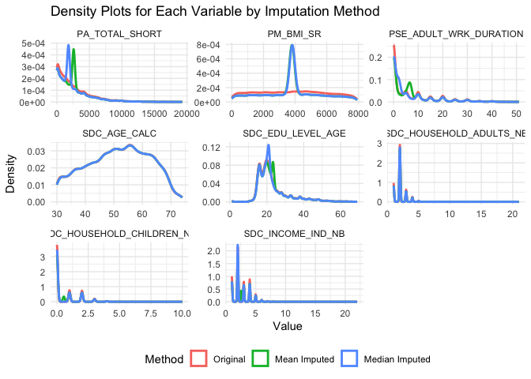
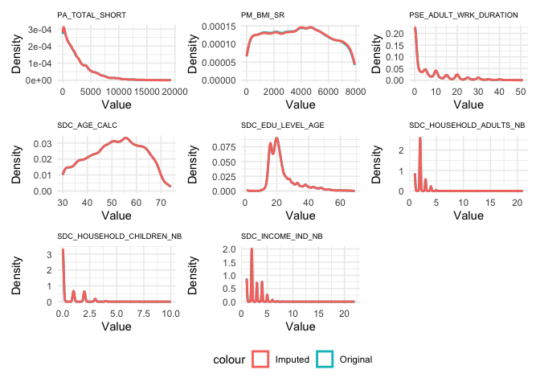

``` r
#  R function that counts how many columns in your dataset belong to each type 
#(col_logical(), col_double(), col_character()):
count_column_types <- function(data) {
  # Count the number of columns for each type
  counts <- data %>%
    summarise(
      logical_cols = sum(sapply(., is.logical)),
      double_cols = sum(sapply(., is.double)),
      character_cols = sum(sapply(., is.character))
    )
  
  # Return the counts as a named vector
  return(counts)
}
```

# Assignment Introduction

**Assignment Goal:** Demonstrate an understanding of various imputation techniques and their implications for analysis.

**Assignment Objectives:**

- Understand the nature and patterns of missing data in a large dataset.

- Apply different imputation methods and assess their suitability for the dataset.

- Compare the results of different imputation techniques using statistical and visual methods.

- Develop insights into the impact of missing data handling on subsequent analyses.

# Dataset Exploration

## Load the provided health administrative dataset.

``` r
# Load the data
data <- read_csv("can_path_data.csv")

# Select all columns between ID and HS_GEN_HEALTH, also select column PA_TOTAL_SHORT, 
# PM_BMI_SR, all columns that contain the string "_EVER" anywhere in their names,
# and all columns that contain the string "WRK_" anywhere in their names
select_data <- data %>% select(ID:HS_GEN_HEALTH, PA_TOTAL_SHORT, PM_BMI_SR, 
                        contains("_EVER"), contains("WRK_"))

# Check dimensions and missing data
cat("The select data has ", ncol(select_data), "columns, ", nrow(select_data), "rows, and ",
    sum(is.na(select_data)), "missing values.\n")
```

```
## The select data has  195 columns,  41187 rows, and  4628628 missing values.
```

## Explore the dataset to identify the extent, patterns, and potential reasons for missing data.


``` r
missing_table <- miss_var_summary(select_data)

# Count the number of variables with pct_miss > 85%
count_high_missing <- missing_table %>%
  filter(pct_miss > 85) %>%
  summarise(count = n())

# Display the result
cat("Number of variables with missing rate more than 85%:", count_high_missing$count, "\n")
```

```
## Number of variables with missing rate more than 85%: 102
```


``` r
# Extract variable names with more than 85% missing data
high_missing_vars <- missing_table %>%
  filter(pct_miss > 85) %>%
  pull(variable)

high_missing_data <- select_data %>%
  select(all_of(high_missing_vars))
```

Check how many columns in the data read as logical variable.

``` r
# Check how many columns in the high missing data belong to each type 
#(col_logical(), col_double(), col_character())
column_type_counts_high <- count_column_types(high_missing_data)

cat("Number of logical variables in high missing data:", column_type_counts_high$logical_cols, 
    ", and number of numeric variables in high missing data:", column_type_counts_high$double_cols, "\n")
```

```
## Number of logical variables in high missing data: 10 , and number of numeric variables in high missing data: 92
```

``` r
# Get rid the columns read as logical
logical_variable_names <- high_missing_data %>%
  select_if(is.logical) %>%
  colnames()

select_data <- select_data %>% select(!(logical_variable_names))
```


## Summarize findings using tables, charts, or heatmaps to visualize missingness.


``` r
# Missing data table
missing_table
```

```
## # A tibble: 195 × 3
##    variable                       n_miss pct_miss
##    <chr>                           <int>    <num>
##  1 DIS_MH_BIPOLAR_EVER             41171    100. 
##  2 DIS_GEN_DS_EVER                 41143     99.9
##  3 DIS_GEN_AIS_EVER                41143     99.9
##  4 DIS_GEN_HEMOPHILIA_EVER         41143     99.9
##  5 DIS_GEN_KS_EVER                 41143     99.9
##  6 DIS_GEN_TS_EVER                 41143     99.9
##  7 DIS_GEN_CAH_EVER                41141     99.9
##  8 DIS_GEN_CF_EVER                 41138     99.9
##  9 DIS_GEN_THALASSEMIA_EVER        41107     99.8
## 10 DIS_CARDIO_PREM_HD_FEMALE_EVER  41081     99.7
## # ℹ 185 more rows
```

``` r
# Visualize missing data
## The bar plot shows how many rows in the dataset have missing values for each variable
gg_miss_var(high_missing_data) + ggtitle("Missing Data by Variable")
```

<!-- -->

``` r
## UpSet is used to display the intersections between multiple sets of data
gg_miss_upset(high_missing_data)
```

<!-- -->

From the table above, we can see that there are 102 variables with more than 85% missing data. Among these 102 variables, 10 are logical variables, and 99 are numeric variables. The logical variables should be excluded, and since the 99 numeric variables are difficult to explain, we do not include them in our further data analysis. This is also supported by the following plots.

The bar chart provides a general overview of missing data per variable. It shows that all 102 variables have more than 35,000 missing data points.

The UpSet plot illustrates patterns of missing data across variables. The highest bar (the leftmost one) represents 41,127 rows where certain variables have missing data. The middle bar corresponds to 44 rows where two specific variables have missing values simultaneously, and the rightmost bar corresponds to 16 rows where another subset of variables is missing together. The large number of rows represented by the 41,127-row bar in the UpSet plot indicates that many variables have missing data for a significant portion of the dataset, which could affect the analysis.


``` r
select_data_less_85 <- select_data %>%
          select(where(~sum(is.na(.x))/length(.x) < 0.85))

# Double check the data
missing_table_less_85 <- miss_var_summary(select_data_less_85)
```

At this step, we can see that all the missing rates are less than 85%, the variables reduced from 194 to 92. Now let's move on to next step. 

Use the UpSet again help us visuliaze potential patterns in missing data that will 
give is information about which variables to include or exclude from our missing data model

``` r
gg_miss_upset(select_data_less_85, order.by = "freq", nsets =10)
```

<!-- -->

**Variables summary**:

- **DIS_IBS_FAM_EVER** : Occurrence of irritable bowel syndrome at any point during 
the life of the participant's relatives (father, mother, siblings and children).

- **PM_BMI_SR** :Weight (in kg) divided by height (in m) squared.
Body mass index = (Weight) / (Standing height * 0.01)^2
Measure taken and reported by the participant.

- **HS_MMG_EVER** : Indicator of whether the female participant has ever had a 
mammography.

- **HS_PAP_EVER** : Indicator of whether the female participant has ever had a 
Pap test (Pap smear). 

- **DIS_ENDO_HB_CHOL_EVER** : Occurrence of high blood cholesterol at any point 
during the life of the participant.

- **DIS_MH_ADDICTION_EVER** : Occurrence of addiction disorder (e.g. alcohol, 
drug or gambling dependence) at any point during the life of the participant.

- **DIS_MH_ANXIETY_EVER** : Occurrence of anxiety disorder at any point during 
the life of the participant.

- **DIS_NEURO_MIGRAINE_EVER** : Occurrence of migraines at any point during the 
life of the participant.

- **DIS_RESP_SLEEP_APNEA_EVER** : Occurrence of sleep apnea at any point during 
the life of the participant.

- **DIS_CARDIO_HD_EVER** : Occurrence of heart disease at any point during the 
life of the participant.

**Summary:** A clear pattern is that the __MH__ variables tend to be missing together.
These variables are related to mental health conditions such as addiction and 
anxiety. Missingness in these variables might be due to participants being unwilling 
to disclose personal mental health details due to stigma or lack of awareness of 
a formal diagnosis. Participants may not recognize or report mental health conditions, 
leading to a consistent pattern of missingness in these variables.


``` r
# Fix the data
select_data_less_85 <- select_data_less_85 %>% mutate_at(3, factor)
select_data_less_85 <- select_data_less_85 %>% mutate_at(5:12, factor)
select_data_less_85 <- select_data_less_85 %>% mutate_at(14:81, factor)
select_data_less_85 <- select_data_less_85 %>% mutate_at(83:93, factor)

# After check the CANPATH_data_dictionary convert the following variables back to num
select_data_less_85$PM_BMI_SR <- as.numeric(select_data_less_85$PM_BMI_SR)
select_data_less_85$SDC_EDU_LEVEL_AGE <- as.numeric(select_data_less_85$SDC_EDU_LEVEL_AGE)

cols_to_convert <- c("SDC_INCOME_IND_NB", "SDC_HOUSEHOLD_ADULTS_NB", "SDC_HOUSEHOLD_CHILDREN_NB")

select_data_less_85[cols_to_convert] <- lapply(select_data_less_85[cols_to_convert], function(x) {
  as.numeric(as.character(x))
})

#str(select_data_less_85) not run
```


``` r
vis_miss(select_data_less_85, warn_large_data = FALSE)
```

<!-- -->


# Apply Imputation Methods

## Mean and Median imputation

First method that I try is the Mean and Median imputation for all the numeric variables.


``` r
# Extract the numeric variables
num_data <- select_data_less_85[sapply(select_data_less_85, is.numeric)]

# For each column in num_data, calculate the summary statistics.
summary_data <- map_dfr(num_data, ~{
  tibble(
    n      = n_distinct(.x),
    na     = sum(is.na(.x)),
    median = median(.x, na.rm = TRUE),
    mean   = mean(.x, na.rm = TRUE)
  )
}, .id = "variable")

# Display the result
summary_data
```

```
## # A tibble: 9 × 5
##   variable                      n    na median     mean
##   <chr>                     <int> <int>  <dbl>    <dbl>
## 1 ADM_STUDY_ID                  4     0      3    2.90 
## 2 SDC_AGE_CALC                 45     0     52   51.5  
## 3 SDC_EDU_LEVEL_AGE            70  2817     21   23.4  
## 4 SDC_INCOME_IND_NB            15  3754      2    2.55 
## 5 SDC_HOUSEHOLD_ADULTS_NB      10  2679      2    2.07 
## 6 SDC_HOUSEHOLD_CHILDREN_NB    11  2896      0    0.553
## 7 PA_TOTAL_SHORT             3421  6763   1782 2574.   
## 8 PM_BMI_SR                  7922 11976   3821 3798.   
## 9 PSE_ADULT_WRK_DURATION       52  5731      2    6.62
```
Now we get a value for median and mean for each numeric variables.


``` r
# Define variables to impute (exclude the ID)
impute_vars <- setdiff(names(num_data), "ADM_STUDY_ID")

## Mean Imputation
# Shadow matrix for num_data
data_shadow_mean <- num_data %>% bind_shadow()

# Create backup columns for each variable to be imputed
for (var in impute_vars) {
  backup_name <- paste0(var, "_not_imputed")
  data_shadow_mean[[backup_name]] <- data_shadow_mean[[var]]
}

# Impute missing values using the mean for each variable in impute_vars
data_shadow_mean <- impute_mean_at(data_shadow_mean, .vars = vars(one_of(impute_vars)))

# Rename the imputed columns to mark them as "mean"
data_mean <- data_shadow_mean %>% 
  rename_with(~ paste0(.,"_mean"), .cols = all_of(impute_vars))

## Median Imputation
# Shadow matrix for num_data
data_shadow_median <- num_data %>% bind_shadow()

# Create backup columns for each variable to be imputed
for (var in impute_vars) {
  backup_name <- paste0(var, "_not_imputed")
  data_shadow_median[[backup_name]] <- data_shadow_median[[var]]
}

# Impute missing values using the median for each variable in impute_vars
data_shadow_median <- impute_median_at(data_shadow_median, .vars = vars(one_of(impute_vars)))

# Rename the imputed columns to mark them as "median"
data_median <- data_shadow_median %>% 
  rename_with(~ paste0(.,"_median"), .cols = all_of(impute_vars))

# Merge the two datasets by row
merged_data <- bind_rows(data_mean, data_median)

# Exclude variables containing "_NA" 
merged_data_filtered <- merged_data[, !grepl("_NA", names(merged_data))]
```


``` r
# Convert the filtered merged_data to a data.table
dt <- as.data.table(merged_data_filtered)

# Identify columns to include: Only those ending with _not_imputed, _mean, or _median
melt_cols <- grep("_(not_imputed|mean|median)$", names(dt), value = TRUE)

# Melt the data
data_long <- melt(dt, measure.vars = melt_cols, variable.name = "var_method", value.name = "value")

# Split 'var_method' into two parts: 'variable' and 'method'
data_long[, variable := sub("_(not_imputed|mean|median)$", "", var_method)]

data_long[, method := sub(".*_", "", var_method)]

# Convert method to a factor for consistent legend ordering and labels
data_long[, method := factor(method,
                             levels = c("imputed", "mean", "median"),
                             labels = c("Original", "Mean Imputed", "Median Imputed"))]

# Plot the density curves for each variable
density_plot <- ggplot(as.data.frame(data_long), aes(x = value, colour = method)) +
  geom_density(size = 1) +
  facet_wrap(~ variable, scales = "free") +
  labs(
    title = "Density Plots for Each Variable by Imputation Method",
    x = "Value",
    y = "Density",
    colour = "Method"
  ) +
  theme_minimal() +
  theme(legend.position = "bottom") 

density_plot
```

<!-- -->

**Key Findings**

- `PA_TOTAL_SHORT` and `PM_BMI_SR`: The mean-imputed distribution (green) and 
the median-imputed distribution (blue) show a shift towards higher values. 
There is a significant imputation effect for both methods, which suggests 
that mean and median imputation are not suitable methods for this variable.

- `PSE_ADULT_WRK_DURATION`: Median-imputed values align more closely with the 
original distribution, except for a small imputation effect between 2 and 3.
Mean-imputed values show a slightly larger imputation effect, ranging from 4 to 9.

- `SDC_AGE_CALC` and `SDC_HOUSEHOLD_ADULTS_NB`: Both the mean and median-imputed 
distributions align well with the original data.

- `SDC_EDU_LEVEL_AGE`:The original and median-imputed distributions align closely, 
with a small imputation effect between 22 and 25.Mean-imputed values, however, 
show a significant imputation effect between 21 and 22.


- `SDC_HOUSEHOLD_CHILDREN_NB`: Median-imputed values align better with the original 
distribution. Mean-imputed values exhibit a small imputation effect at 0.2.

- `SDC_INCOME_IND_NB`: Median-imputed values show better alignment with the 
original data. Mean-imputed values show a small imputation effect at 2.5.

**Summary**

- Compared to mean imputation, the median-imputed distributions generally align 
more closely with the original distributions.

- Variables like `PM_BMI_SR` and `SDC_AGE_CALC` show minimal differences between 
the original and imputed distributions, indicating that the data for these 
variables can effectively use both mean and median imputation.

## Multivariate Imputation by Chained Equations (MICE)


``` r
# This model take so much time, I only run one time and save the model result
# data_imp <- mice(select_data_less_85, m = 1, maxit = 1) 
# saveRDS(data_imp,file="data_imp.rds")

data_imp <- readRDS("data_imp.rds")

data_imp_c <- complete(data_imp)

# miss_var_summary(select_data_less_85) # double check the missing rate, not run
# miss_var_summary(data_imp_c) # double check the missing rate, not run

# data_imp$method

data_imp_complete <- data_imp_c %>%
  rename_with(~ paste0(., "_com"))

joined_data <- select_data_less_85 %>%
  left_join(data_imp_complete, by = c("ID" = "ID_com"))
```


``` r
# Define variable pairs
variable_pairs <- list(
  list(original = "PA_TOTAL_SHORT", imputed = "PA_TOTAL_SHORT_com"),
  list(original = "PM_BMI_SR", imputed = "PM_BMI_SR_com"),
  list(original = "PSE_ADULT_WRK_DURATION", imputed = "PSE_ADULT_WRK_DURATION_com"),
  list(original = "SDC_AGE_CALC", imputed = "SDC_AGE_CALC_com"),
  list(original = "SDC_EDU_LEVEL_AGE", imputed = "SDC_EDU_LEVEL_AGE_com"),
  list(original = "SDC_HOUSEHOLD_ADULTS_NB", imputed = "SDC_HOUSEHOLD_ADULTS_NB_com"),
  list(original = "SDC_HOUSEHOLD_CHILDREN_NB", imputed = "SDC_HOUSEHOLD_CHILDREN_NB_com"),
  list(original = "SDC_INCOME_IND_NB", imputed = "SDC_INCOME_IND_NB_com")
)

# Create individual plots without legends
plots <- invisible(lapply(variable_pairs, function(pair) {
  ggplot(data = joined_data) +
    geom_density(aes_string(x = pair$original, colour = "'Original'"), size = 1) +
    geom_density(aes_string(x = pair$imputed, colour = "'Imputed'"), size = 1) +
    labs(
      title = paste(pair$original),
      x = "Value",
      y = "Density"
    ) +
    theme_minimal() +
    theme(
      legend.position = "none",
      plot.title = element_text(size = 7)
    )
}))

# Create a legend plot
legend_plot <- ggplot(data = joined_data) +
  geom_density(aes(x = 0, colour = "Original")) +
  geom_density(aes(x = 0, colour = "Imputed")) +
  theme_void() +
  theme(legend.position = "bottom")

# Combine plots into a grid with a shared legend
combined_plot <- wrap_plots(plots, ncol = 3) +
  plot_layout(guides = "collect") &
  theme(legend.position = "bottom")

# Display the combined plot
print(combined_plot)
```

<!-- -->

**Summary:** The `mice` imputation method appears to perform well for the example 
numeric variables, as most imputed distributions align closely with the original 
distributions.


# Analysis of Imputed Data
Now have an imputation model with some uncertainty and we want to get a pooled 
regression result the also accounts for the uncertainty


``` r
set.seed(123)
## Typical regression 
lm_model <- lm(PA_TOTAL_SHORT ~ SDC_INCOME + SDC_EDU_LEVEL_AGE, 
                data = select_data_less_85)
## Pooled regression 
lm_mice <- data_imp %>% with(lm(PA_TOTAL_SHORT ~ SDC_INCOME + SDC_EDU_LEVEL_AGE))
```


``` r
lm_mice_pooled <- pool(lm_mice)
summary(lm_mice_pooled)
```

```
## 
## Call:
## lm(formula = PA_TOTAL_SHORT ~ SDC_INCOME + SDC_EDU_LEVEL_AGE)
## 
## Residuals:
##     Min      1Q  Median      3Q     Max 
## -3076.6 -1945.5  -787.1  1122.4 16806.6 
## 
## Coefficients:
##                   Estimate Std. Error t value Pr(>|t|)    
## (Intercept)       2355.055    109.469  21.513  < 2e-16 ***
## SDC_INCOME2       -129.310    117.389  -1.102  0.27066    
## SDC_INCOME3         55.017    109.249   0.504  0.61455    
## SDC_INCOME4         46.781    108.504   0.431  0.66637    
## SDC_INCOME5        104.745    108.754   0.963  0.33548    
## SDC_INCOME6        114.041    108.198   1.054  0.29189    
## SDC_INCOME7        142.611    112.506   1.268  0.20495    
## SDC_INCOME8        445.726    115.238   3.868  0.00011 ***
## SDC_EDU_LEVEL_AGE    4.377      1.435   3.050  0.00229 ** 
## ---
## Signif. codes:  0 '***' 0.001 '**' 0.01 '*' 0.05 '.' 0.1 ' ' 1
## 
## Residual standard error: 2646 on 41178 degrees of freedom
## Multiple R-squared:  0.002161,	Adjusted R-squared:  0.001967 
## F-statistic: 11.14 on 8 and 41178 DF,  p-value: 7.186e-16
```

``` r
summary(lm_model)
```

```
## 
## Call:
## lm(formula = PA_TOTAL_SHORT ~ SDC_INCOME + SDC_EDU_LEVEL_AGE, 
##     data = select_data_less_85)
## 
## Residuals:
##     Min      1Q  Median      3Q     Max 
## -3076.6 -1931.3  -783.3  1151.9 16763.3 
## 
## Coefficients:
##                   Estimate Std. Error t value Pr(>|t|)    
## (Intercept)       2533.811    141.947  17.850  < 2e-16 ***
## SDC_INCOME2       -196.775    151.778  -1.296  0.19483    
## SDC_INCOME3        -50.454    141.640  -0.356  0.72168    
## SDC_INCOME4        -94.175    140.656  -0.670  0.50315    
## SDC_INCOME5        -85.480    140.685  -0.608  0.54346    
## SDC_INCOME6        -61.006    140.023  -0.436  0.66307    
## SDC_INCOME7         -4.151    144.522  -0.029  0.97709    
## SDC_INCOME8        244.031    147.495   1.655  0.09804 .  
## SDC_EDU_LEVEL_AGE    4.743      1.748   2.714  0.00666 ** 
## ---
## Signif. codes:  0 '***' 0.001 '**' 0.01 '*' 0.05 '.' 0.1 ' ' 1
## 
## Residual standard error: 2630 on 29242 degrees of freedom
##   (11936 observations deleted due to missingness)
## Multiple R-squared:  0.00152,	Adjusted R-squared:  0.001247 
## F-statistic: 5.564 on 8 and 29242 DF,  p-value: 4.61e-07
```

**Summary**

Here we get quite different results from when we don't deal with missing data. 

- The `lm_mice_pooled` includes 41178 obervation.

- The `lm_model` includes 29,242 observations, as 11936 observations (~ 30%) were
missing data.

- The standard errors in the `lm_mice_pooled` are smaller compared to the `lm_model`. 
This reflects better statistical efficiency due to the inclusion of more 
observations via imputation.


# Disscussion and Conclusion

As seen from the density plots, the mean and median imputation methods introduce 
significant imputation effects, particularly for variables with high missing rates. 
For instance, `PM_BMI_SR` (29.1% missing) and `PA_TOTAL_SHORT` (16.4% missing) 
show big peak in their distribution due to imputation, indicating that these 
methods might distort the data structure for variables with a high percentage of 
missing values. The imputation effect is less evident for variables with lower missing rates. 
The advantages of mean and median imputation methods include being easy to 
implement and interpret, as well as being computationally efficient, even for 
large datasets. However, their disadvantages include failing to account for 
relationships between variables, which may lead to biased results.

The **mice** method performs better for numerical variables and is also effective 
for categorical variables, even for those with high missing rates. For example, 
in numerical variables, the density plots show that **mice** retains the overall 
distribution shape more effectively than mean/median imputation. Categorical variables 
also benefit from **mice**, as regression models that include imputed categorical 
data yield smaller standard errors and improved model performance. The **mice** 
effectively utilizes the relationships between variables to impute missing values, 
thereby reducing bias in the analysis. However, **mice** is computationally intensive, 
requiring significant time and resources, making it less practical for very large datasets. 
Nonetheless, it is highly suitable for datasets with moderate to high missing rates 
and complex variable relationships.


