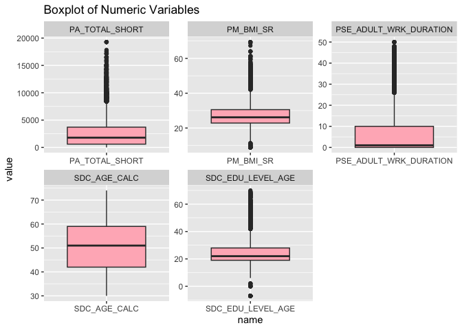

# Assignment Introduction

**Assignment Goal:** Work with the Can Path Student Dataset to perform a Random Forest analysis, conduct detailed hyperparameter tuning, and compare the performance of your model with other models or configurations. This exercise emphasizes building robust models and evaluating their performance critically.


**Assignment Objectives:**

- Develop proficiency in implementing Random Forest algorithms for predictive analysis.

- Understand the importance of hyperparameter tuning and its impact on model performance.

- Gain experience in comparing models to select the best-performing configuration.

- Learn to interpret Random Forest results, including feature importance.

# Loading the data


``` r
data <- read_csv("/Users/linali/Documents/Winter_2025/CHEP898_JAN22_2025/mice_all_imp.csv")

data <- data %>% mutate_at(3, factor)
data <- data %>% mutate_at(5:6, factor)
data <- data %>% mutate_at(8:12, factor)
data <- data %>% mutate_at(15:81, factor)
data <- data %>% mutate_at(83:93, factor)

data$ID <- NULL
data$ADM_STUDY_ID <- NULL
```

## Preparing Data

### Preparing Diabetes Data


``` r
table(data$DIS_DIAB_EVER)
```

```
## 
##     0     1     2 
## 36714  3114  1359
```

``` r
data <- data %>%
	mutate(diabetes = case_when(
		DIS_DIAB_EVER == 0 ~ "No",
		DIS_DIAB_EVER == 1 ~ "Yes",
		DIS_DIAB_EVER == 2 ~ "No")) %>%
		mutate(diabetes = as.factor(diabetes))

data$DIS_DIAB_EVER <- NULL
```

### Preparing General Health Data


``` r
table(data$HS_GEN_HEALTH)
```

```
## 
##     1     2     3     4     5 
##   832  3377 12783 17183  7012
```

``` r
### Combining levels 1 and 2 just to have enough sample. We won't do upscaling for this example
data <- data %>%
	mutate(gen_health = case_when(
		HS_GEN_HEALTH == 1 ~ 1,
		HS_GEN_HEALTH == 2 ~ 1,
		HS_GEN_HEALTH == 3 ~ 2,
		HS_GEN_HEALTH == 4 ~ 3,	
		HS_GEN_HEALTH == 5 ~ 4)) %>%
		mutate(gen_health = as.factor(gen_health))

data$HS_GEN_HEALTH <- NULL
```
```
glimpse(data) 
```
### Exploratory data analysis (EDA)


``` r
skimr::skim(data)
```


Table: Data summary

|                         |      |
|:------------------------|:-----|
|Name                     |data  |
|Number of rows           |41187 |
|Number of columns        |91    |
|_______________________  |      |
|Column type frequency:   |      |
|factor                   |86    |
|numeric                  |5     |
|________________________ |      |
|Group variables          |None  |


**Variable type: factor**

|skim_variable             | n_missing| complete_rate|ordered | n_unique|top_counts                            |
|:-------------------------|---------:|-------------:|:-------|--------:|:-------------------------------------|
|SDC_GENDER                |         0|             1|FALSE   |        2|2: 25987, 1: 15200                    |
|SDC_MARITAL_STATUS        |         0|             1|FALSE   |        5|1: 30651, 5: 4194, 2: 3595, 4: 1555   |
|SDC_EDU_LEVEL             |         0|             1|FALSE   |        8|6: 11010, 4: 10175, 2: 7809, 7: 6268  |
|SDC_INCOME                |         0|             1|FALSE   |        8|6: 8826, 4: 8008, 5: 7667, 3: 6815    |
|SDC_INCOME_IND_NB         |         0|             1|FALSE   |       14|2: 17378, 1: 7736, 4: 6650, 3: 6287   |
|SDC_HOUSEHOLD_ADULTS_NB   |         0|             1|FALSE   |        9|2: 25083, 1: 8140, 3: 5294, 4: 2137   |
|SDC_HOUSEHOLD_CHILDREN_NB |         0|             1|FALSE   |       10|0: 28200, 1: 5667, 2: 5448, 3: 1490   |
|HS_ROUTINE_VISIT_EVER     |         0|             1|FALSE   |        2|1: 40651, 0: 536                      |
|HS_DENTAL_VISIT_EVER      |         0|             1|FALSE   |        2|1: 41077, 0: 110                      |
|HS_FOBT_EVER              |         0|             1|FALSE   |        2|0: 21644, 1: 19543                    |
|HS_COL_EVER               |         0|             1|FALSE   |        2|0: 26248, 1: 14939                    |
|HS_SIG_EVER               |         0|             1|FALSE   |        2|0: 34780, 1: 6407                     |
|HS_SIG_COL_EVER           |         0|             1|FALSE   |        2|0: 23688, 1: 17499                    |
|HS_POLYP_EVER             |         0|             1|FALSE   |        3|3: 23684, 2: 13004, 1: 4499           |
|HS_PSA_EVER               |         0|             1|FALSE   |        3|-7: 25987, 1: 9587, 0: 5613           |
|WH_CONTRACEPTIVES_EVER    |         0|             1|FALSE   |        3|1: 22683, -7: 15236, 0: 3268          |
|WH_HFT_EVER               |         0|             1|FALSE   |        3|0: 24183, -7: 15228, 1: 1776          |
|WH_MENOPAUSE_EVER         |         0|             1|FALSE   |        3|-7: 15236, 1: 13165, 0: 12786         |
|WH_HRT_EVER               |         0|             1|FALSE   |        3|0: 20059, -7: 15237, 1: 5891          |
|WH_HYSTERECTOMY_EVER      |         0|             1|FALSE   |        3|0: 21739, -7: 15222, 1: 4226          |
|WH_OOPHORECTOMY_EVER      |         0|             1|FALSE   |        3|0: 23519, -7: 15200, 1: 2468          |
|HS_MMG_EVER               |         0|             1|FALSE   |        2|1: 30835, 0: 10352                    |
|HS_PAP_EVER               |         0|             1|FALSE   |        2|1: 39851, 0: 1336                     |
|DIS_HBP_EVER              |         0|             1|FALSE   |        3|0: 29994, 1: 9922, 2: 1271            |
|DIS_MI_EVER               |         0|             1|FALSE   |        3|0: 38237, 2: 1999, 1: 951             |
|DIS_STROKE_EVER           |         0|             1|FALSE   |        3|0: 38416, 2: 2204, 1: 567             |
|DIS_ASTHMA_EVER           |         0|             1|FALSE   |        3|0: 34302, 1: 5401, 2: 1484            |
|DIS_COPD_EVER             |         0|             1|FALSE   |        3|0: 38771, 2: 1709, 1: 707             |
|DIS_DEP_EVER              |         0|             1|FALSE   |        3|0: 34796, 1: 5136, 2: 1255            |
|DIS_LC_EVER               |         0|             1|FALSE   |        3|0: 39196, 2: 1833, 1: 158             |
|DIS_CH_EVER               |         0|             1|FALSE   |        3|0: 39080, 2: 1813, 1: 294             |
|DIS_CROHN_EVER            |         0|             1|FALSE   |        3|0: 38857, 2: 1982, 1: 348             |
|DIS_UC_EVER               |         0|             1|FALSE   |        3|0: 38602, 2: 1993, 1: 592             |
|DIS_IBS_EVER              |         0|             1|FALSE   |        3|0: 35749, 1: 3805, 2: 1633            |
|DIS_ECZEMA_EVER           |         0|             1|FALSE   |        3|0: 34845, 1: 5090, 2: 1252            |
|DIS_SLE_EVER              |         0|             1|FALSE   |        3|0: 39181, 2: 1816, 1: 190             |
|DIS_PS_EVER               |         0|             1|FALSE   |        3|0: 37398, 1: 2178, 2: 1611            |
|DIS_MS_EVER               |         0|             1|FALSE   |        3|0: 38982, 2: 1900, 1: 305             |
|DIS_OP_EVER               |         0|             1|FALSE   |        3|0: 37053, 1: 2258, 2: 1876            |
|DIS_ARTHRITIS_EVER        |         0|             1|FALSE   |        3|0: 29750, 1: 10301, 2: 1136           |
|DIS_CANCER_EVER           |         0|             1|FALSE   |        2|0: 36574, 1: 4613                     |
|DIS_HBP_FAM_EVER          |         0|             1|FALSE   |        3|1: 26623, 0: 9534, 2: 5030            |
|DIS_MI_FAM_EVER           |         0|             1|FALSE   |        3|1: 16637, 0: 14153, 2: 10397          |
|DIS_STROKE_FAM_EVER       |         0|             1|FALSE   |        3|0: 17235, 2: 12403, 1: 11549          |
|DIS_ASTHMA_FAM_EVER       |         0|             1|FALSE   |        3|0: 16943, 2: 12432, 1: 11812          |
|DIS_COPD_FAM_EVER         |         0|             1|FALSE   |        3|0: 19240, 2: 15211, 1: 6736           |
|DIS_DEP_FAM_EVER          |         0|             1|FALSE   |        3|0: 17465, 2: 12444, 1: 11278          |
|DIS_DIAB_FAM_EVER         |         0|             1|FALSE   |        3|1: 16826, 0: 14839, 2: 9522           |
|DIS_LC_FAM_EVER           |         0|             1|FALSE   |        3|0: 20225, 2: 16723, 1: 4239           |
|DIS_CH_FAM_EVER           |         0|             1|FALSE   |        3|0: 21056, 2: 17704, 1: 2427           |
|DIS_CROHN_FAM_EVER        |         0|             1|FALSE   |        3|0: 20678, 2: 17514, 1: 2995           |
|DIS_UC_FAM_EVER           |         0|             1|FALSE   |        3|0: 20360, 2: 17284, 1: 3543           |
|DIS_IBS_FAM_EVER          |         0|             1|FALSE   |        3|0: 18047, 2: 15431, 1: 7709           |
|DIS_ECZEMA_FAM_EVER       |         0|             1|FALSE   |        3|0: 17162, 2: 13481, 1: 10544          |
|DIS_SLE_FAM_EVER          |         0|             1|FALSE   |        3|0: 20727, 2: 19163, 1: 1297           |
|DIS_PS_FAM_EVER           |         0|             1|FALSE   |        3|0: 18720, 2: 15410, 1: 7057           |
|DIS_MS_FAM_EVER           |         0|             1|FALSE   |        3|0: 21418, 2: 18491, 1: 1278           |
|DIS_OP_FAM_EVER           |         0|             1|FALSE   |        3|0: 15849, 2: 13781, 1: 11557          |
|DIS_ARTHRITIS_FAM_EVER    |         0|             1|FALSE   |        3|1: 22056, 0: 11322, 2: 7809           |
|DIS_CANCER_FAM_EVER       |         0|             1|FALSE   |        2|1: 23412, 0: 17775                    |
|DIS_CANCER_F_EVER         |         0|             1|FALSE   |        2|0: 28520, 1: 12667                    |
|DIS_CANCER_M_EVER         |         0|             1|FALSE   |        2|0: 29289, 1: 11898                    |
|DIS_CANCER_SIB_EVER       |         0|             1|FALSE   |        2|0: 33742, 1: 7445                     |
|DIS_CANCER_CHILD_EVER     |         0|             1|FALSE   |        2|0: 39920, 1: 1267                     |
|ALC_EVER                  |         0|             1|FALSE   |        2|1: 38734, 0: 2453                     |
|SMK_CIG_EVER              |         0|             1|FALSE   |        2|0: 22255, 1: 18932                    |
|SMK_CIG_WHOLE_EVER        |         0|             1|FALSE   |        3|-7: 18925, 0: 15189, 1: 7073          |
|DIS_ENDO_HB_CHOL_EVER     |         0|             1|FALSE   |        3|0: 27182, 1: 11792, 2: 2213           |
|DIS_CARDIO_HD_EVER        |         0|             1|FALSE   |        3|0: 37038, 2: 2689, 1: 1460            |
|DIS_RESP_SLEEP_APNEA_EVER |         0|             1|FALSE   |        3|0: 35355, 1: 3916, 2: 1916            |
|DIS_MH_ANXIETY_EVER       |         0|             1|FALSE   |        3|0: 35223, 1: 5197, 2: 767             |
|DIS_MH_ADDICTION_EVER     |         0|             1|FALSE   |        3|0: 37404, 2: 2730, 1: 1053            |
|DIS_NEURO_MIGRAINE_EVER   |         0|             1|FALSE   |        3|0: 29222, 1: 10356, 2: 1609           |
|PSE_WRK_FREQ              |         0|             1|FALSE   |        5|0: 32587, 1: 3782, 3: 1691, 4: 1576   |
|WRK_FULL_TIME             |         0|             1|FALSE   |        2|1: 22307, 0: 18880                    |
|WRK_PART_TIME             |         0|             1|FALSE   |        2|0: 34986, 1: 6201                     |
|WRK_RETIREMENT            |         0|             1|FALSE   |        2|0: 33443, 1: 7744                     |
|WRK_HOME_FAMILY           |         0|             1|FALSE   |        2|0: 38545, 1: 2642                     |
|WRK_UNABLE                |         0|             1|FALSE   |        2|0: 39567, 1: 1620                     |
|WRK_UNEMPLOYED            |         0|             1|FALSE   |        2|0: 39100, 1: 2087                     |
|WRK_UNPAID                |         0|             1|FALSE   |        2|0: 40009, 1: 1178                     |
|WRK_STUDENT               |         0|             1|FALSE   |        2|0: 40719, 1: 468                      |
|WRK_EMPLOYMENT            |         0|             1|FALSE   |        2|1: 28538, 0: 12649                    |
|WRK_SCHEDULE_CUR_CAT      |         0|             1|FALSE   |        8|1: 21126, -7: 12788, 6: 2952, 4: 2056 |
|diabetes                  |         0|             1|FALSE   |        2|No: 38073, Yes: 3114                  |
|gen_health                |         0|             1|FALSE   |        4|3: 17183, 2: 12783, 4: 7012, 1: 4209  |


**Variable type: numeric**

|skim_variable          | n_missing| complete_rate|    mean|      sd|    p0|    p25|     p50|     p75|    p100|hist  |
|:----------------------|---------:|-------------:|-------:|-------:|-----:|------:|-------:|-------:|-------:|:-----|
|SDC_AGE_CALC           |         0|             1|   51.48|   10.80| 30.00|  43.00|   52.00|   60.00|    74.0|▅▆▇▇▃ |
|SDC_EDU_LEVEL_AGE      |         0|             1|   25.34|    9.17| -7.00|  19.00|   23.00|   28.00|    73.0|▁▇▃▁▁ |
|PA_TOTAL_SHORT         |         0|             1| 2606.47| 2691.81|  0.00| 600.00| 1800.00| 3795.00| 19278.0|▇▂▁▁▁ |
|PM_BMI_SR              |         0|             1|   27.66|    6.22|  8.86|  23.41|   26.62|   30.68|    69.4|▁▇▂▁▁ |
|PSE_ADULT_WRK_DURATION |         0|             1|    6.69|    9.48|  0.00|   0.00|    2.00|   10.00|    51.0|▇▂▁▁▁ |

There are a total of **86** factor variables and **5** numeric variables in the dataset. 
There are no missing values. Among the factor variables, 8 variables include the 
level **-7**, which represents "Not Applicable". These variables are:\

- __HS_PSA_EVER__: Indicates whether the **male** participant has ever had a PSA 
  blood test for prostate cancer screening.

- __WH_CONTRACEPTIVES_EVER__: Indicates whether the **female** participant has 
  ever used hormonal contraceptives.

- __WH_HFT_EVER__: Indicates whether the **female** participant has ever received 
  hormone fertility treatment.

- __WH_MENOPAUSE_EVER__: Indicates whether the **female** participant has 
  experienced menopause.

- __WH_HRT_EVER__: Indicates whether the **female** participant has ever used 
  hormone replacement therapy.

- __WH_HYSTERECTOMY_EVER__: Indicates whether the **female** participant has had 
  a hysterectomy.

- __SMK_CIG_WHOLE_EVER__: Indicates whether the participant has ever smoked a whole 
cigarette, even if they haven’t smoked more than 100 cigarettes in their lifetime.

- __WRK_SCHEDULE_CUR_CAT__: Work schedule type. 

At this point, among the 8 factor variables with the -7 level, **5** are related 
specifically to **females**. It is likely that the -7 values in these variables 
indicate male participants, for whom these variables are not applicable.

My following research question in this study focuses on **female** participants, 
I will restrict the dataset to **females** only for the remainder of the analysis.
The variable __HS_PSA_EVER__, which applies only to males, will be excluded.
However, __WRK_SCHEDULE_CUR_CAT__ will be retained for analysis as it is relevant 
regardless of gender.


``` r
# # Filter to keep only female participants and Remove male-specific variable
female_data <- data %>%
  filter(SDC_GENDER == 2) %>%
  select(-SDC_GENDER,-HS_PSA_EVER)
```


``` r
numeric_data <- female_data %>%
  select(where(is.numeric))

cor_data <- numeric_data %>%
  correlate()

cor_data
```

```
## # A tibble: 5 × 6
##   term                   SDC_AGE_CALC SDC_EDU_LEVEL_AGE PA_TOTAL_SHORT PM_BMI_SR
##   <chr>                         <dbl>             <dbl>          <dbl>     <dbl>
## 1 SDC_AGE_CALC                NA               0.114           0.0762   0.0534  
## 2 SDC_EDU_LEVEL_AGE            0.114          NA               0.00956  0.000988
## 3 PA_TOTAL_SHORT               0.0762          0.00956        NA       -0.0489  
## 4 PM_BMI_SR                    0.0534          0.000988       -0.0489  NA       
## 5 PSE_ADULT_WRK_DURATION       0.316           0.0145          0.0585   0.0458  
## # ℹ 1 more variable: PSE_ADULT_WRK_DURATION <dbl>
```

``` r
rplot(cor_data, colours = c("indianred2", "black", "skyblue1")) +
  theme(axis.text.x = element_text(angle = 15, hjust = 1))
```

<!-- -->

As seen from the above table and figure, the variable __SDC_AGE_CALC__ and 
__PSE_ADULT_WRK_DURATION__ have a moderate positive relationship. All other 
correlations range between −0.05 and 0.11, indicating weak or negligible relationships.


``` r
female_data %>%
  select(where(is.numeric)) %>%
  pivot_longer(everything()) %>%
  ggplot(aes(x = value)) +
  geom_histogram(bins = 30, fill = "skyblue", color = "white") +
  facet_wrap(~name, scales = "free") +
  labs(title = "Distribution of Numeric Features")
```

<!-- -->

``` r
# Boxplot to find outliers
female_data %>%
  select(where(is.numeric)) %>%
  pivot_longer(everything()) %>%
  ggplot(aes(x = name, y = value)) +
  geom_boxplot(fill = "lightpink") +
  facet_wrap(~name, scales = "free") +
  labs(title = "Boxplot of Numeric Variables")
```

<!-- -->

As show on the above hist and boxplot, there are some skew and outlier from each
varialbe.

- __PA_TOTAL_SHORT__:\
  - Histogram: Highly right-skewed with a long tail beyond 10,000.\
  - Boxplot: Many high-value outliers.\
  - Apply log-transformation to reduce skew.

- __PM_BMI_SR__:\
  - Histogram: Moderately right-skewed.\
  - Boxplot: Some extreme values.\
  - Keep them, because those values may be plausible (e.g., obesity).

- __PSE_ADULT_WRK_DURATION__:\
  - Histogram: Extremely skewed right; most values are close to 0.\
  - Boxplot: Several very large outliers.\
  _ Model it as categorical (None/Short/Long)
  
- __SDC_AGE_CALC__:\
  - Histogram: Fairly uniform to bell-shaped.\
  - Boxplot: Slight spread but no serious outliers.\
  - No transformation needed.

- __SDC_EDU_LEVEL_AGE__:
  - Histogram: Right-skewed, clustered in early adulthood but with long tail up to 70+.\
  - Boxplot: Some outliers in high values.\
  - Capping top values (age > 60 may indicate data entry error).


``` r
# PA_TOTAL_SHORT
female_data$PA_TOTAL_SHORT <- log(female_data$PA_TOTAL_SHORT)

# PSE_ADULT_WRK_DURATION
female_data <- female_data %>%
  mutate(WRK_DURATION_CAT = case_when(
    PSE_ADULT_WRK_DURATION == 0 ~ "None",
    PSE_ADULT_WRK_DURATION > 0 & PSE_ADULT_WRK_DURATION <= 5 ~ "Short",
    PSE_ADULT_WRK_DURATION > 5 ~ "Long"
  )) %>%
  mutate(WRK_DURATION_CAT = factor(WRK_DURATION_CAT,
                                    levels = c("None", "Short", "Long")))

female_data$PSE_ADULT_WRK_DURATION <- NULL

# SDC_EDU_LEVEL_AGE
female_data <- female_data %>% filter(SDC_EDU_LEVEL_AGE <= 60)
```

# Fit the Model


``` r
set.seed(10)

# Cross Validation Split
cv_split <- initial_validation_split(data, 
                            strata = gen_health, 
                            prop = c(0.70, 0.20))

# Create data frames for the two sets:
train_data <- training(cv_split)
test_data  <- testing(cv_split)
```


``` r
# Set the number of cores on your computer
cores <- parallel::detectCores()
```

## Recipe

``` r
health_recipe <- recipe(gen_health ~ ., data = train_data) %>%
  step_zv(all_predictors())
```

## Baseline RF model


``` r
rf_model <- rand_forest() %>%
  set_engine("ranger") %>%
  set_mode("classification")

# Baseline Workflow
baseline_workflow <- 
  workflow() %>%
  add_model(rf_model) %>%
  add_recipe(health_recipe)

# Fit on training data
baseline_fit <- 
  baseline_workflow %>%
  fit(data = train_data)

# Predict on test data
baseline_preds <- predict(baseline_fit, test_data, type = "class") %>%
  bind_cols(test_data)
```


## Tuned RF model 


``` r
tuning_rf_model <- rand_forest(mtry = tune(), min_n = tune(), trees = 500) %>% 
              set_engine("ranger", num.threads = cores) %>% 
              set_mode("classification")

tuning_health_workflow <- workflow() %>%
  add_model(tuning_rf_model) %>%
  add_recipe(health_recipe)
```


``` r
set.seed(100)

folds <- vfold_cv(train_data, v = 10, strata = gen_health) 

rf_grid <- grid_regular(
              mtry(range = c(5, 50)),
              min_n(range = c(5, 30)),
              levels = 5  
            )
```


``` r
health_fit <- tune_grid(
                tuning_health_workflow,
                resamples = folds,
                grid = rf_grid, 
                control = control_resamples(save_pred = TRUE, 
                                                  verbose = TRUE))
```


``` r
health_fit
```

```
## # Tuning results
## # 10-fold cross-validation using stratification 
## # A tibble: 10 × 5
##    splits               id     .metrics          .notes           .predictions
##    <list>               <chr>  <list>            <list>           <list>      
##  1 <split [25946/2884]> Fold01 <tibble [75 × 6]> <tibble [0 × 3]> <tibble>    
##  2 <split [25946/2884]> Fold02 <tibble [75 × 6]> <tibble [0 × 3]> <tibble>    
##  3 <split [25946/2884]> Fold03 <tibble [75 × 6]> <tibble [0 × 3]> <tibble>    
##  4 <split [25946/2884]> Fold04 <tibble [75 × 6]> <tibble [0 × 3]> <tibble>    
##  5 <split [25946/2884]> Fold05 <tibble [75 × 6]> <tibble [0 × 3]> <tibble>    
##  6 <split [25946/2884]> Fold06 <tibble [75 × 6]> <tibble [0 × 3]> <tibble>    
##  7 <split [25947/2883]> Fold07 <tibble [75 × 6]> <tibble [0 × 3]> <tibble>    
##  8 <split [25947/2883]> Fold08 <tibble [75 × 6]> <tibble [0 × 3]> <tibble>    
##  9 <split [25950/2880]> Fold09 <tibble [75 × 6]> <tibble [0 × 3]> <tibble>    
## 10 <split [25950/2880]> Fold10 <tibble [75 × 6]> <tibble [0 × 3]> <tibble>
```


``` r
health_fit %>%
  collect_metrics() %>%
  filter(.metric == "accuracy") %>%
  mutate(min_n = factor(min_n)) %>%
  ggplot(aes(mtry, mean, color = min_n)) +
  geom_line(alpha = 0.5, size = 1.5) +
  geom_point() +
  labs(y = "Accuracy")
```

<!-- -->

Key Finding: The best performance is achieved when mtry is **38**, and min_n is **5**.

### Tuned Final model


``` r
rf_best<- health_fit %>% select_best(metric = "accuracy")
rf_best
```

```
## # A tibble: 1 × 3
##    mtry min_n .config              
##   <int> <int> <chr>                
## 1    38     5 Preprocessor1_Model04
```

``` r
rf_auc_fit <- 
  health_fit %>% 
  collect_predictions(parameters = rf_best) 

final_model <- finalize_model(tuning_rf_model,rf_best)

final_model
```

```
## Random Forest Model Specification (classification)
## 
## Main Arguments:
##   mtry = 38
##   trees = 500
##   min_n = 5
## 
## Engine-Specific Arguments:
##   num.threads = cores
## 
## Computational engine: ranger
```

### Fit Tuned Final Model


``` r
final_rf_workflow <- workflow() %>%
                      add_recipe(health_recipe) %>%
                      add_model(final_model)

final_results <- final_rf_workflow %>%
                    last_fit(cv_split)

final_results %>%
  collect_metrics()
```

```
## # A tibble: 3 × 4
##   .metric     .estimator .estimate .config             
##   <chr>       <chr>          <dbl> <chr>               
## 1 accuracy    multiclass     0.509 Preprocessor1_Model1
## 2 roc_auc     hand_till      0.746 Preprocessor1_Model1
## 3 brier_class multiclass     0.304 Preprocessor1_Model1
```

# Model Comparisons


``` r
# Metrics for baseline model
baseline_metrics <- tibble(
  Model = "Baseline RF",
  Accuracy = accuracy(baseline_preds, truth = gen_health, estimate = .pred_class)$.estimate,
  Sensitivity = sens(baseline_preds, truth = gen_health, estimate = .pred_class)$.estimate,
  Specificity = spec(baseline_preds, truth = gen_health, estimate = .pred_class)$.estimate,
  F1 = f_meas(baseline_preds, truth = gen_health, estimate = .pred_class)$.estimate
)

# Metrics for final tuned model
final_metrics <- tibble(
  Model = "Tuned RF",
  Accuracy = accuracy(rf_auc_fit, truth = gen_health, estimate = .pred_class)$.estimate,
  Sensitivity = sens(rf_auc_fit, truth = gen_health, estimate = .pred_class)$.estimate,
  Specificity = spec(rf_auc_fit, truth = gen_health, estimate = .pred_class)$.estimate,
  F1 = f_meas(rf_auc_fit, truth = gen_health, estimate = .pred_class)$.estimate
)

comparison_table <- bind_rows(baseline_metrics, final_metrics)

comparison_table
```

```
## # A tibble: 2 × 5
##   Model       Accuracy Sensitivity Specificity    F1
##   <chr>          <dbl>       <dbl>       <dbl> <dbl>
## 1 Baseline RF    0.511       0.385       0.800 0.389
## 2 Tuned RF       0.512       0.399       0.804 0.409
```

As shown in the table above, the tuned Random Forest model performs slightly better 
than the baseline model across all key metrics: accuracy, sensitivity, specificity, 
and F1 score. Although the improvements are modest, they suggest that hyperparameter 
tuning provided a marginal performance boost. These small gains may still hold 
practical value, especially in sensitive domains such as health prediction or 
medical screening, where even a minor increase in model performance can translate 
to improved outcomes or earlier interventions. However, it's important to consider 
the computational cost of tuning, particularly when working with large datasets, 
and weigh it against the relatively small improvement in model performance.


# Variable Importance


``` r
tree_prep <- prep(health_recipe)

final_model %>%
  set_engine("ranger", importance = "permutation") %>%
  fit(gen_health ~ .,
    data = juice(tree_prep)) %>%
  vip(geom = "point")
```

<!-- -->

The plot above shows the top 10 most important variables from the final model based 
on the **female-only** dataset. The variables __PM_BMI_SR__, __PA_TOTAL_SHORT__, and 
__DIS_HBP_EVER__ are the most predictive for general health status. BMI is the 
most influential predictor, with higher BMI likely associated with poorer perceived 
general health among females. Physical activity level is strongly linked to perceived 
health, meaning that greater activity is generally associated with better health. 
High blood pressure status is also a key chronic condition that influences health perception.

Socioeconomic factors such as __SDC_EDU_LEVEL__ and __SDC_INCOME__ play significant 
roles, reflecting known social determinants of health—both education level and income 
are strongly correlated with health outcomes. The variable __WRK_UNABLE__, which indicates 
inability to work due to health reasons, is a direct indicator of compromised health status.

Variables such as __SDC_AGE_CALC__, __SDC_EDU_LEVEL_AGE__, __diabetes__, and __DIS_ARTHRITIS_EVER__ are ranked lower in importance but remain relevant to general health. Interestingly, __diabetes__ appears less important in this model, possibly due to overlapping effects with BMI or low variability in this subgroup.


