``` r
knitr::opts_chunk$set(echo = TRUE)
library(tidyverse)
library(adjustedCurves)
library(boot)
library(broom)
library(geepack)
library(here)
library(MatchIt)
library(tableone)
library(sjPlot)
library(survey)
library(episensr) 
library(epitools)
library(gtsummary)
library(cobalt)
library(cowplot)
library(geepack)
library(WeightIt)
library(gridExtra)
library(patchwork)
```

# Assignment Introduction

**Assignment Goal:** Work with the Can Path Student Dataset to perform a Machine 
Learning-based Matching Analysis. This assignment will require student to apply 
a machine learning approach to match cases and controls (or equivalent groups), 
analyze the quality of the matches, and interpret the results.


**Assignment Objectives:**

- Learn to apply machine learning algorithms for matching analysis.

- Develop skills in preprocessing and feature engineering for matching.

- Assess the quality of matches using statistical and visual methods.

- Interpret and report findings from a matching analysis.

**My research question**:

- __Does working full-time (treatment) associate with arthritis in our sample?__


# Loading the data


``` r
data <- read_csv("/Users/linali/Documents/Winter_2025/CHEP898_JAN22_2025/mice_all_imp.csv")
```

```
## Rows: 41187 Columns: 93
## ── Column specification ────────────────────────────────────────────────────────
## Delimiter: ","
## chr  (1): ID
## dbl (92): ADM_STUDY_ID, SDC_GENDER, SDC_AGE_CALC, SDC_MARITAL_STATUS, SDC_ED...
## 
## ℹ Use `spec()` to retrieve the full column specification for this data.
## ℹ Specify the column types or set `show_col_types = FALSE` to quiet this message.
```

``` r
data <- data %>% mutate_at(3, factor)
data <- data %>% mutate_at(5:6, factor)
data <- data %>% mutate_at(8:12, factor)
data <- data %>% mutate_at(15:81, factor)
data <- data %>% mutate_at(83:93, factor)

data$ID <- NULL
data$ADM_STUDY_ID <- NULL
```

## Preparing the Data

### Arthritis Data

Arthritis = 0 (No Arthritis ever), Arthritis = 1 (Yes Arthritis ever)


``` r
table(data$DIS_ARTHRITIS_EVER)
```

```
## 
##     0     1     2 
## 29750 10301  1136
```

``` r
data <- data %>%
	mutate(arthritis = case_when(
		DIS_ARTHRITIS_EVER == 0 ~ 0,
		DIS_ARTHRITIS_EVER == 1 ~ 1,
		DIS_ARTHRITIS_EVER == 2 ~ 0)) %>%
		mutate(arthritis = as.factor(arthritis))

table(data$DIS_ARTHRITIS_EVER, data$arthritis)
```

```
##    
##         0     1
##   0 29750     0
##   1     0 10301
##   2  1136     0
```

``` r
data$DIS_ARTHRITIS_EVER <- NULL
```


### Full_time Data

full_time = 0 (Not full-time employed/self-employed),

full_time = 1 (Yes full-time employed/self-employed)


``` r
table(data$WRK_FULL_TIME)
```

```
## 
##     0     1 
## 18880 22307
```

``` r
data <- data %>%
	mutate(full_time = case_when(
		WRK_FULL_TIME == 0 ~ 0,
		WRK_FULL_TIME == 1 ~ 1)) %>%
		mutate(full_time = as.factor(full_time))

table(data$WRK_FULL_TIME, data$full_time)
```

```
##    
##         0     1
##   0 18880     0
##   1     0 22307
```

``` r
data$WRK_FULL_TIME <- NULL
```
# Model

## Unadjusted / Non-matched Models


``` r
table(data$full_time, data$arthritis)
```

```
##    
##         0     1
##   0 12886  5994
##   1 18000  4307
```


``` r
# Epi tools method
fulltime <- c("No", "Yes")
outcome <- c("Case", "Control")
dat <- matrix(c(5994, 12886, 4307, 18000),2,2,byrow=TRUE)
dimnames(dat) <- list("Arthritis" = fulltime, "Outcome" = outcome)
oddsratio(dat, rev="c")
```

```
## $data
##          Outcome
## Arthritis Control  Case Total
##     No      12886  5994 18880
##     Yes     18000  4307 22307
##     Total   30886 10301 41187
## 
## $measure
##          odds ratio with 95% C.I.
## Arthritis  estimate     lower     upper
##       No  1.0000000        NA        NA
##       Yes 0.5144337 0.4916432 0.5381914
## 
## $p.value
##          two-sided
## Arthritis midp.exact  fisher.exact    chi.square
##       No          NA            NA            NA
##       Yes          0 3.090352e-185 1.673705e-185
## 
## $correction
## [1] FALSE
## 
## attr(,"method")
## [1] "median-unbiased estimate & mid-p exact CI"
```

``` r
# Logistic regression
lr <- glm(arthritis ~ full_time, data = data, family = "binomial")

tab_model(lr)
```

```
## Profiled confidence intervals may take longer time to compute.
##   Use `ci_method="wald"` for faster computation of CIs.
```

<table style="border-collapse:collapse; border:none;">
<tr>
<th style="border-top: double; text-align:center; font-style:normal; font-weight:bold; padding:0.2cm;  text-align:left; ">&nbsp;</th>
<th colspan="3" style="border-top: double; text-align:center; font-style:normal; font-weight:bold; padding:0.2cm; ">arthritis</th>
</tr>
<tr>
<td style=" text-align:center; border-bottom:1px solid; font-style:italic; font-weight:normal;  text-align:left; ">Predictors</td>
<td style=" text-align:center; border-bottom:1px solid; font-style:italic; font-weight:normal;  ">Odds Ratios</td>
<td style=" text-align:center; border-bottom:1px solid; font-style:italic; font-weight:normal;  ">CI</td>
<td style=" text-align:center; border-bottom:1px solid; font-style:italic; font-weight:normal;  ">p</td>
</tr>
<tr>
<td style=" padding:0.2cm; text-align:left; vertical-align:top; text-align:left; ">(Intercept)</td>
<td style=" padding:0.2cm; text-align:left; vertical-align:top; text-align:center;  ">0.47</td>
<td style=" padding:0.2cm; text-align:left; vertical-align:top; text-align:center;  ">0.45&nbsp;&ndash;&nbsp;0.48</td>
<td style=" padding:0.2cm; text-align:left; vertical-align:top; text-align:center;  "><strong>&lt;0.001</strong></td>
</tr>
<tr>
<td style=" padding:0.2cm; text-align:left; vertical-align:top; text-align:left; ">full time [1]</td>
<td style=" padding:0.2cm; text-align:left; vertical-align:top; text-align:center;  ">0.51</td>
<td style=" padding:0.2cm; text-align:left; vertical-align:top; text-align:center;  ">0.49&nbsp;&ndash;&nbsp;0.54</td>
<td style=" padding:0.2cm; text-align:left; vertical-align:top; text-align:center;  "><strong>&lt;0.001</strong></td>
</tr>
<tr>
<td style=" padding:0.2cm; text-align:left; vertical-align:top; text-align:left; padding-top:0.1cm; padding-bottom:0.1cm; border-top:1px solid;">Observations</td>
<td style=" padding:0.2cm; text-align:left; vertical-align:top; padding-top:0.1cm; padding-bottom:0.1cm; text-align:left; border-top:1px solid;" colspan="3">41187</td>
</tr>
<tr>
<td style=" padding:0.2cm; text-align:left; vertical-align:top; text-align:left; padding-top:0.1cm; padding-bottom:0.1cm;">R<sup>2</sup> Tjur</td>
<td style=" padding:0.2cm; text-align:left; vertical-align:top; padding-top:0.1cm; padding-bottom:0.1cm; text-align:left;" colspan="3">0.020</td>
</tr>

</table>


**Finding:** The naive analysis suggests that individuals who are employed full-time 
have **0.51** times the odds of having arthritis compared to those who do not work full-time.

## Define Closeness

Define variables are associated with the treatment (Full time employed) in order 
to create a model that can help us define what causes treatment. General rule we 
want to include more variables than less in our propensity score. 

- __WRK_PART_TIME__: Indicator of whether the participant is currently employed 
part-time (paid employment or self-employed). Part time means less than 30 houurs per week

- __WRK_STUDENT__: Indicator of whether the participant is currently a student.

- __WRK_EMPLOYMENT__: Indicator of whether the participant currently has paid employment 
or is self-employed (including full-time and part time status).

- __SDC_GENDER__: Gender of the participant.

- __SDC_EDU_LEVEL__: Highest level of education completed by the participant.

- __SDC_INCOME__: Average annual income, before taxes, of the participant's entire 
household including salaries, pensions, and allowances.

- __HS_DENTAL_VISIT_EVER__: Indicator of whether the participant has ever had a 
dental professional visit.

- __DIS_DIAB_EVER__: Occurrence of diabetes at any point during the life of the 
participant.

- __DIS_CANCER_EVER__: Occurrence of cancer at any point during the life of the 
participant.

- __DIS_DEP_EVER__: Occurrence of major depression at any point during the life 
of the participant.

- __SMK_CIG_EVER__: Indicator of whether the participant has ever smoked at least 
100 cigarettes during his lifetime.

- __SDC_HOUSEHOLD_ADULTS_NB__: Number of adults (age 18 or older) currently living 
in the same household including the participant.

- __SDC_HOUSEHOLD_CHILDREN_NB__: Number of children (under 18 years of age) currently 
living in the participant's household.

I have chosen the above variables because __WRK_PART_TIME__, __WRK_STUDENT__, 
and __WRK_EMPLOYMENT__ are direct indicators of work status and help model the 
propensity to work full-time. __SDC_EDU_LEVEL__ and __SDC_INCOME__ are socioeconomic 
indicators that likely influence job type and the ability to work full-time. 
__SDC_GENDER__ is known to influence employment patterns. __SDC_HOUSEHOLD_ADULTS_NB__
and __SDC_HOUSEHOLD_CHILDREN_NB__ may influence work hours, caregiving burden, and 
employment choices. __DIS_DEP_EVER__, __DIS_CANCER_EVER__, and __DIS_DIAB_EVER__ are 
chronic conditions that can affect a person’s ability or choice to work full-time, 
and are also related to inflammation or immune function, which is biologically linked 
to arthritis. __HS_DENTAL_VISIT_EVER__ is a proxy for access to care and possibly 
general health engagement.

### Summary statistics of baseline variables by treatment status


``` r
covariates <- select(data, WRK_PART_TIME,WRK_EMPLOYMENT, WRK_STUDENT, SDC_INCOME, 
                     SDC_EDU_LEVEL, SDC_GENDER,HS_DENTAL_VISIT_EVER, 
                     DIS_DIAB_EVER,DIS_CANCER_EVER, DIS_DEP_EVER,SMK_CIG_EVER, 
                     SDC_HOUSEHOLD_ADULTS_NB,SDC_HOUSEHOLD_CHILDREN_NB  )
baselines <- colnames(covariates)

tab_baseline <- CreateTableOne(vars = baselines,
                       data = data, 
                       strata = "full_time", 
                       test = FALSE, #mute P-value calculation;
                       smd = TRUE,
                       addOverall = TRUE)

kableone(tab_baseline, smd = TRUE, showAllLevels = FALSE )
```


|                              |Overall      |0            |1            |SMD   |
|:-----------------------------|:------------|:------------|:------------|:-----|
|n                             |41187        |18880        |22307        |      |
|WRK_PART_TIME = 1 (%)         |6201 (15.1)  |5851 (31.0)  |350 ( 1.6)   |0.869 |
|WRK_EMPLOYMENT = 1 (%)        |28538 (69.3) |7896 (41.8)  |20642 (92.5) |1.283 |
|WRK_STUDENT = 1 (%)           |468 ( 1.1)   |267 ( 1.4)   |201 ( 0.9)   |0.048 |
|SDC_INCOME (%)                |             |             |             |0.453 |
|1                             |574 ( 1.4)   |415 ( 2.2)   |159 ( 0.7)   |      |
|2                             |2447 ( 5.9)  |1737 ( 9.2)  |710 ( 3.2)   |      |
|3                             |6815 (16.5)  |4109 (21.8)  |2706 (12.1)  |      |
|4                             |8008 (19.4)  |3771 (20.0)  |4237 (19.0)  |      |
|5                             |7667 (18.6)  |3200 (16.9)  |4467 (20.0)  |      |
|6                             |8826 (21.4)  |3260 (17.3)  |5566 (25.0)  |      |
|7                             |3965 ( 9.6)  |1348 ( 7.1)  |2617 (11.7)  |      |
|8                             |2885 ( 7.0)  |1040 ( 5.5)  |1845 ( 8.3)  |      |
|SDC_EDU_LEVEL (%)             |             |             |             |0.189 |
|0                             |79 ( 0.2)    |46 ( 0.2)    |33 ( 0.1)    |      |
|1                             |565 ( 1.4)   |353 ( 1.9)   |212 ( 1.0)   |      |
|2                             |7809 (19.0)  |4122 (21.8)  |3687 (16.5)  |      |
|3                             |3486 ( 8.5)  |1761 ( 9.3)  |1725 ( 7.7)  |      |
|4                             |10175 (24.7) |4448 (23.6)  |5727 (25.7)  |      |
|5                             |1795 ( 4.4)  |847 ( 4.5)   |948 ( 4.2)   |      |
|6                             |11010 (26.7) |4588 (24.3)  |6422 (28.8)  |      |
|7                             |6268 (15.2)  |2715 (14.4)  |3553 (15.9)  |      |
|SDC_GENDER = 2 (%)            |25987 (63.1) |12642 (67.0) |13345 (59.8) |0.149 |
|HS_DENTAL_VISIT_EVER = 1 (%)  |41077 (99.7) |18826 (99.7) |22251 (99.7) |0.007 |
|DIS_DIAB_EVER (%)             |             |             |             |0.130 |
|0                             |36714 (89.1) |16419 (87.0) |20295 (91.0) |      |
|1                             |3114 ( 7.6)  |1741 ( 9.2)  |1373 ( 6.2)  |      |
|2                             |1359 ( 3.3)  |720 ( 3.8)   |639 ( 2.9)   |      |
|DIS_CANCER_EVER = 1 (%)       |4613 (11.2)  |2772 (14.7)  |1841 ( 8.3)  |0.203 |
|DIS_DEP_EVER (%)              |             |             |             |0.093 |
|0                             |34796 (84.5) |15607 (82.7) |19189 (86.0) |      |
|1                             |5136 (12.5)  |2636 (14.0)  |2500 (11.2)  |      |
|2                             |1255 ( 3.0)  |637 ( 3.4)   |618 ( 2.8)   |      |
|SMK_CIG_EVER = 1 (%)          |18932 (46.0) |9267 (49.1)  |9665 (43.3)  |0.116 |
|SDC_HOUSEHOLD_ADULTS_NB (%)   |             |             |             |0.102 |
|1                             |8140 (19.8)  |3994 (21.2)  |4146 (18.6)  |      |
|2                             |25083 (60.9) |11579 (61.3) |13504 (60.5) |      |
|3                             |5294 (12.9)  |2247 (11.9)  |3047 (13.7)  |      |
|4                             |2137 ( 5.2)  |836 ( 4.4)   |1301 ( 5.8)  |      |
|5                             |440 ( 1.1)   |180 ( 1.0)   |260 ( 1.2)   |      |
|6                             |61 ( 0.1)    |26 ( 0.1)    |35 ( 0.2)    |      |
|7                             |21 ( 0.1)    |12 ( 0.1)    |9 ( 0.0)     |      |
|8                             |10 ( 0.0)    |5 ( 0.0)     |5 ( 0.0)     |      |
|21                            |1 ( 0.0)     |1 ( 0.0)     |0 ( 0.0)     |      |
|SDC_HOUSEHOLD_CHILDREN_NB (%) |             |             |             |0.344 |
|0                             |28200 (68.5) |14504 (76.8) |13696 (61.4) |      |
|1                             |5667 (13.8)  |1992 (10.6)  |3675 (16.5)  |      |
|2                             |5448 (13.2)  |1704 ( 9.0)  |3744 (16.8)  |      |
|3                             |1490 ( 3.6)  |520 ( 2.8)   |970 ( 4.3)   |      |
|4                             |305 ( 0.7)   |126 ( 0.7)   |179 ( 0.8)   |      |
|5                             |51 ( 0.1)    |21 ( 0.1)    |30 ( 0.1)    |      |
|6                             |11 ( 0.0)    |6 ( 0.0)     |5 ( 0.0)     |      |
|7                             |10 ( 0.0)    |5 ( 0.0)     |5 ( 0.0)     |      |
|9                             |4 ( 0.0)     |2 ( 0.0)     |2 ( 0.0)     |      |
|10                            |1 ( 0.0)     |0 ( 0.0)     |1 ( 0.0)     |      |


**Key Finding:** The baseline characteristics table summarizes differences between 
participants who work full-time and those who do not, across a range of observed 
covariates. Several variables show substantial imbalance, as indicated by large 
SMD values, such as __WRK_EMPLOYMENT__ (SMD = 1.283), __WRK_PART_TIME__ (0.869), and 
__SDC_INCOME__ (0.453; e.g., levels 1, 2, 3, 6, 7, 8), reflecting expected differences 
in employment status and socioeconomic factors. Additional imbalances are observed 
in __SDC_HOUSEHOLD_CHILDREN_NB__ (0.344; e.g., levels 0 to 3) and __DIS_CANCER_EVER__ (0.203), 
indicating that individuals working full-time may differ significantly in household 
structure and health history. Moderate imbalance is also present in variables such 
as __SDC_EDU_LEVEL__ (e.g., levels 1, 2, 6), __SDC_GENDER__, __DIS_DIAB_EVER__, 
and __SMK_CIG_EVER__, while other variables such as __WRK_STUDENT__ and __HS_DENTAL_VISIT_EVER__
appear more balanced. Overall, the observed imbalances confirm the need for propensity score 
matching or adjustment to achieve covariate balance and reduce bias before estimating 
the effect of full-time employment on arthritis


## Naive Regression

If we were not doing matching we would adjust the treatment variable and 
covariates as in a typical regression analysis. 


``` r
fit_naive <- glm(arthritis ~ full_time + WRK_PART_TIME + WRK_EMPLOYMENT + 
                   WRK_STUDENT + SDC_INCOME + SDC_EDU_LEVEL + SDC_GENDER + 
                   HS_DENTAL_VISIT_EVER + DIS_DIAB_EVER + DIS_CANCER_EVER + 
                   DIS_DEP_EVER + SMK_CIG_EVER +  SDC_HOUSEHOLD_ADULTS_NB + 
                   SDC_HOUSEHOLD_CHILDREN_NB, 
                 family = "binomial", 
                 data = data)

# tab_model(fit_naive) #results show at the last section
```

## Matching Nearest Neighbour


``` r
kkn_1_1 <- matchit(arthritis ~ full_time + WRK_PART_TIME + WRK_EMPLOYMENT + 
                     WRK_STUDENT + SDC_INCOME + SDC_EDU_LEVEL + SDC_GENDER + 
                     HS_DENTAL_VISIT_EVER + DIS_DIAB_EVER + DIS_CANCER_EVER + 
                     DIS_DEP_EVER + SMK_CIG_EVER +  SDC_HOUSEHOLD_ADULTS_NB + 
                     SDC_HOUSEHOLD_CHILDREN_NB, 
                   data = data, 
                   method = "nearest",
                   distance = "glm")

summary(kkn_1_1, un = FALSE)
```

```
## 
## Call:
## matchit(formula = arthritis ~ full_time + WRK_PART_TIME + WRK_EMPLOYMENT + 
##     WRK_STUDENT + SDC_INCOME + SDC_EDU_LEVEL + SDC_GENDER + HS_DENTAL_VISIT_EVER + 
##     DIS_DIAB_EVER + DIS_CANCER_EVER + DIS_DEP_EVER + SMK_CIG_EVER + 
##     SDC_HOUSEHOLD_ADULTS_NB + SDC_HOUSEHOLD_CHILDREN_NB, data = data, 
##     method = "nearest", distance = "glm")
## 
## Summary of Balance for Matched Data:
##                             Means Treated Means Control Std. Mean Diff.
## distance                           0.3032        0.3025          0.0063
## full_time0                         0.5819        0.5857         -0.0077
## full_time1                         0.4181        0.4143          0.0077
## WRK_PART_TIME0                     0.8368        0.8365          0.0008
## WRK_PART_TIME1                     0.1632        0.1635         -0.0008
## WRK_EMPLOYMENT0                    0.4144        0.4134          0.0022
## WRK_EMPLOYMENT1                    0.5856        0.5866         -0.0022
## WRK_STUDENT0                       0.9892        0.9917         -0.0235
## WRK_STUDENT1                       0.0108        0.0083          0.0235
## SDC_INCOME1                        0.0149        0.0136          0.0104
## SDC_INCOME2                        0.0765        0.0729          0.0135
## SDC_INCOME3                        0.2097        0.2041          0.0138
## SDC_INCOME4                        0.2164        0.2171         -0.0017
## SDC_INCOME5                        0.1764        0.1798         -0.0089
## SDC_INCOME6                        0.1763        0.1820         -0.0150
## SDC_INCOME7                        0.0737        0.0776         -0.0149
## SDC_INCOME8                        0.0562        0.0530          0.0139
## SDC_EDU_LEVEL0                     0.0024        0.0016          0.0178
## SDC_EDU_LEVEL1                     0.0202        0.0190          0.0083
## SDC_EDU_LEVEL2                     0.2274        0.2276         -0.0005
## SDC_EDU_LEVEL3                     0.0983        0.1017         -0.0114
## SDC_EDU_LEVEL4                     0.2528        0.2593         -0.0150
## SDC_EDU_LEVEL5                     0.0465        0.0475         -0.0046
## SDC_EDU_LEVEL6                     0.2144        0.2111          0.0080
## SDC_EDU_LEVEL7                     0.1379        0.1322          0.0166
## SDC_GENDER1                        0.3099        0.3108         -0.0021
## SDC_GENDER2                        0.6901        0.6892          0.0021
## HS_DENTAL_VISIT_EVER0              0.0026        0.0022          0.0076
## HS_DENTAL_VISIT_EVER1              0.9974        0.9978         -0.0076
## DIS_DIAB_EVER0                     0.8507        0.8558         -0.0144
## DIS_DIAB_EVER1                     0.1117        0.1071          0.0148
## DIS_DIAB_EVER2                     0.0376        0.0371          0.0026
## DIS_CANCER_EVER0                   0.8311        0.8449         -0.0368
## DIS_CANCER_EVER1                   0.1689        0.1551          0.0368
## DIS_DEP_EVER0                      0.7831        0.7948         -0.0283
## DIS_DEP_EVER1                      0.1813        0.1718          0.0247
## DIS_DEP_EVER2                      0.0355        0.0334          0.0115
## SMK_CIG_EVER0                      0.4712        0.4642          0.0140
## SMK_CIG_EVER1                      0.5288        0.5358         -0.0140
## SDC_HOUSEHOLD_ADULTS_NB1           0.2244        0.2135          0.0263
## SDC_HOUSEHOLD_ADULTS_NB2           0.5868        0.5971         -0.0209
## SDC_HOUSEHOLD_ADULTS_NB3           0.1251        0.1265         -0.0041
## SDC_HOUSEHOLD_ADULTS_NB4           0.0502        0.0512         -0.0044
## SDC_HOUSEHOLD_ADULTS_NB5           0.0116        0.0109          0.0072
## SDC_HOUSEHOLD_ADULTS_NB6           0.0012        0.0007          0.0142
## SDC_HOUSEHOLD_ADULTS_NB7           0.0004        0.0002          0.0099
## SDC_HOUSEHOLD_ADULTS_NB8           0.0002        0.0000          0.0139
## SDC_HOUSEHOLD_ADULTS_NB21          0.0000        0.0000          0.0000
## SDC_HOUSEHOLD_CHILDREN_NB0         0.8079        0.8193         -0.0291
## SDC_HOUSEHOLD_CHILDREN_NB1         0.0963        0.0897          0.0224
## SDC_HOUSEHOLD_CHILDREN_NB2         0.0677        0.0622          0.0216
## SDC_HOUSEHOLD_CHILDREN_NB3         0.0208        0.0207          0.0007
## SDC_HOUSEHOLD_CHILDREN_NB4         0.0056        0.0056          0.0000
## SDC_HOUSEHOLD_CHILDREN_NB5         0.0014        0.0017         -0.0105
## SDC_HOUSEHOLD_CHILDREN_NB6         0.0003        0.0006         -0.0171
## SDC_HOUSEHOLD_CHILDREN_NB7         0.0000        0.0000          0.0000
## SDC_HOUSEHOLD_CHILDREN_NB9         0.0001        0.0001          0.0000
## SDC_HOUSEHOLD_CHILDREN_NB10        0.0000        0.0000          0.0000
##                             Var. Ratio eCDF Mean eCDF Max Std. Pair Dist.
## distance                        1.0284    0.0003   0.0063          0.0064
## full_time0                           .    0.0038   0.0038          0.3159
## full_time1                           .    0.0038   0.0038          0.3159
## WRK_PART_TIME0                       .    0.0003   0.0003          0.4001
## WRK_PART_TIME1                       .    0.0003   0.0003          0.4001
## WRK_EMPLOYMENT0                      .    0.0011   0.0011          0.3754
## WRK_EMPLOYMENT1                      .    0.0011   0.0011          0.3754
## WRK_STUDENT0                         .    0.0024   0.0024          0.1721
## WRK_STUDENT1                         .    0.0024   0.0024          0.1721
## SDC_INCOME1                          .    0.0013   0.0013          0.1966
## SDC_INCOME2                          .    0.0036   0.0036          0.3247
## SDC_INCOME3                          .    0.0056   0.0056          0.3887
## SDC_INCOME4                          .    0.0007   0.0007          0.3454
## SDC_INCOME5                          .    0.0034   0.0034          0.3044
## SDC_INCOME6                          .    0.0057   0.0057          0.2769
## SDC_INCOME7                          .    0.0039   0.0039          0.2282
## SDC_INCOME8                          .    0.0032   0.0032          0.2120
## SDC_EDU_LEVEL0                       .    0.0009   0.0009          0.0809
## SDC_EDU_LEVEL1                       .    0.0012   0.0012          0.2236
## SDC_EDU_LEVEL2                       .    0.0002   0.0002          0.3660
## SDC_EDU_LEVEL3                       .    0.0034   0.0034          0.3022
## SDC_EDU_LEVEL4                       .    0.0065   0.0065          0.3750
## SDC_EDU_LEVEL5                       .    0.0010   0.0010          0.2499
## SDC_EDU_LEVEL6                       .    0.0033   0.0033          0.2867
## SDC_EDU_LEVEL7                       .    0.0057   0.0057          0.3038
## SDC_GENDER1                          .    0.0010   0.0010          0.3422
## SDC_GENDER2                          .    0.0010   0.0010          0.3422
## HS_DENTAL_VISIT_EVER0                .    0.0004   0.0004          0.0949
## HS_DENTAL_VISIT_EVER1                .    0.0004   0.0004          0.0949
## DIS_DIAB_EVER0                       .    0.0051   0.0051          0.4737
## DIS_DIAB_EVER1                       .    0.0047   0.0047          0.4259
## DIS_DIAB_EVER2                       .    0.0005   0.0005          0.2833
## DIS_CANCER_EVER0                     .    0.0138   0.0138          0.4254
## DIS_CANCER_EVER1                     .    0.0138   0.0138          0.4254
## DIS_DEP_EVER0                        .    0.0116   0.0116          0.4504
## DIS_DEP_EVER1                        .    0.0095   0.0095          0.4308
## DIS_DEP_EVER2                        .    0.0021   0.0021          0.2853
## SMK_CIG_EVER0                        .    0.0070   0.0070          0.4041
## SMK_CIG_EVER1                        .    0.0070   0.0070          0.4041
## SDC_HOUSEHOLD_ADULTS_NB1             .    0.0110   0.0110          0.3972
## SDC_HOUSEHOLD_ADULTS_NB2             .    0.0103   0.0103          0.4578
## SDC_HOUSEHOLD_ADULTS_NB3             .    0.0014   0.0014          0.3515
## SDC_HOUSEHOLD_ADULTS_NB4             .    0.0010   0.0010          0.2970
## SDC_HOUSEHOLD_ADULTS_NB5             .    0.0008   0.0008          0.1846
## SDC_HOUSEHOLD_ADULTS_NB6             .    0.0005   0.0005          0.0484
## SDC_HOUSEHOLD_ADULTS_NB7             .    0.0002   0.0002          0.0296
## SDC_HOUSEHOLD_ADULTS_NB8             .    0.0002   0.0002          0.0139
## SDC_HOUSEHOLD_ADULTS_NB21            .    0.0000   0.0000          0.0000
## SDC_HOUSEHOLD_CHILDREN_NB0           .    0.0115   0.0115          0.2301
## SDC_HOUSEHOLD_CHILDREN_NB1           .    0.0066   0.0066          0.2527
## SDC_HOUSEHOLD_CHILDREN_NB2           .    0.0054   0.0054          0.1708
## SDC_HOUSEHOLD_CHILDREN_NB3           .    0.0001   0.0001          0.1586
## SDC_HOUSEHOLD_CHILDREN_NB4           .    0.0000   0.0000          0.0091
## SDC_HOUSEHOLD_CHILDREN_NB5           .    0.0004   0.0004          0.0791
## SDC_HOUSEHOLD_CHILDREN_NB6           .    0.0003   0.0003          0.0512
## SDC_HOUSEHOLD_CHILDREN_NB7           .    0.0000   0.0000          0.0000
## SDC_HOUSEHOLD_CHILDREN_NB9           .    0.0000   0.0000          0.0002
## SDC_HOUSEHOLD_CHILDREN_NB10          .    0.0000   0.0000          0.0000
## 
## Sample Sizes:
##           Control Treated
## All         30886   10301
## Matched     10301   10301
## Unmatched   20585       0
## Discarded       0       0
```

**Finding:** Here we have a 1:1 match with 10301 treated (full_time) matched to 
the same number of no full_time based on the variables we think are associated 
with the treatment. We can see that the SMD is much better for the matched data 
compared to the treatment/control comparison we did previously.

### Histogram of the propensity score


``` r
knn_data <- match.data(kkn_1_1)

ggplot(data = knn_data, aes(x = distance, fill = as.factor(full_time))) +
  geom_histogram(binwidth = 0.02, position = "identity", alpha = 0.5) +
  labs(x = "Propensity Score", fill = "Full-Time") +
  theme_minimal()
```

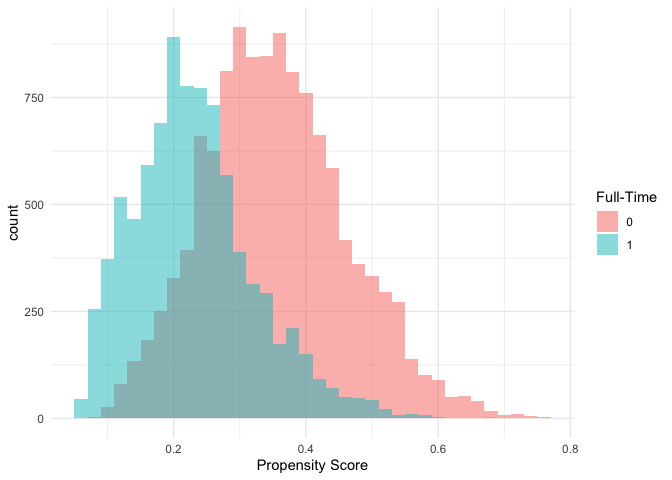<!-- -->

**Finding:**

- Different distributions:
   - The full-time group tends to have lower propensity scores, mostly clustering 
   between 0.1 and 0.4.
   - The pink group (non-full-time workers) has scores spread more toward the right, 
   especially in the 0.25 to 0.55 range.

- Overlap exists:
   - There is considerable overlap between the two groups in the 0.15 to 0.4 range.
   - This is important because it indicates common support, meaning there's a region 
   where both groups have similar scores, and thus can be fairly compared after matching.


``` r
plot(kkn_1_1, type = "jitter", interactive = FALSE)
```

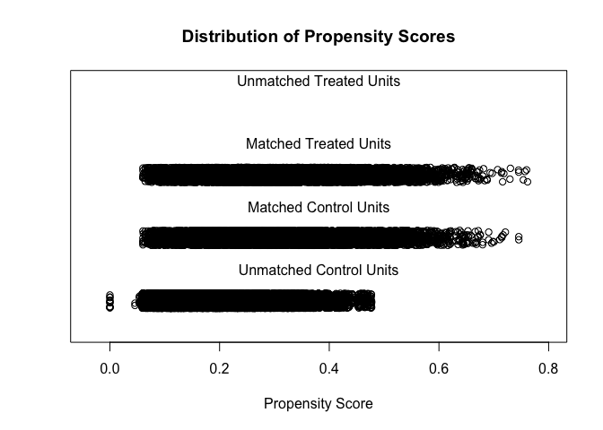<!-- -->

**Finding:** 

- The two distributions (matched treated vs. matched control) look very similar.

- Some individuals from both the treated and control groups with very low or very 
high propensity scores were not matched.

- The plot shows that after matching, the distribution of propensity scores for 
treated and control units is well-aligned, indicating that the matching procedure 
effectively balanced the two groups.


``` r
plot(kkn_1_1, type = "density", interactive = FALSE,
     which.xs = ~ full_time + WRK_PART_TIME + WRK_EMPLOYMENT + WRK_STUDENT + 
       SDC_INCOME + SDC_EDU_LEVEL + SDC_GENDER + HS_DENTAL_VISIT_EVER + 
       DIS_DIAB_EVER + DIS_CANCER_EVER + DIS_DEP_EVER + SMK_CIG_EVER +  
       SDC_HOUSEHOLD_ADULTS_NB + SDC_HOUSEHOLD_CHILDREN_NB)
```

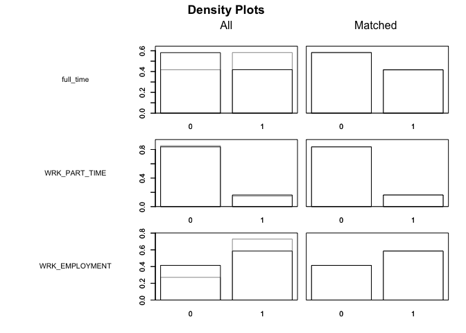<!-- -->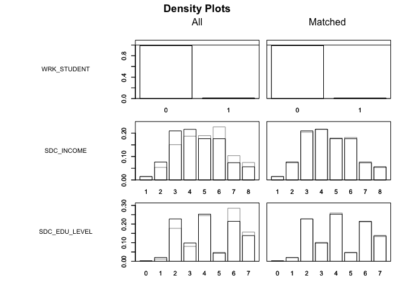<!-- -->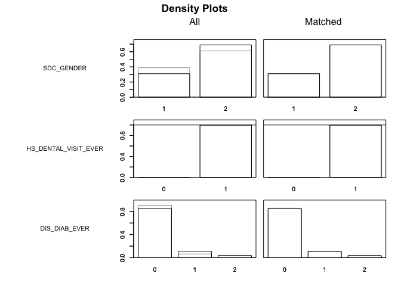<!-- -->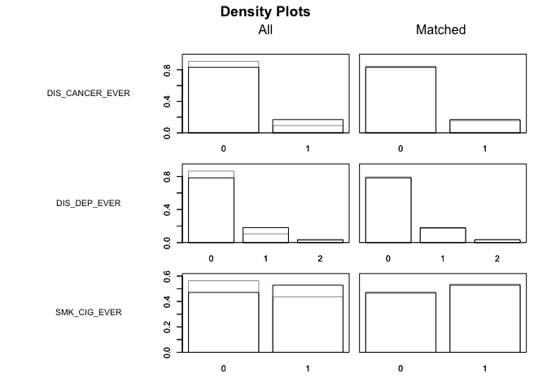<!-- -->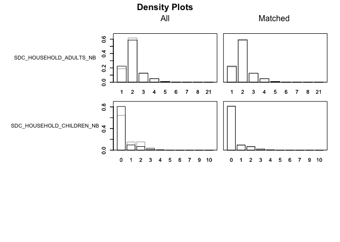<!-- -->

**Finding:** Imbalances are represented by the differences between the black (treated) 
and gray (control) distributions. We can see all the variables appear to have improved 
balance after matching.

## Generalized Full matching


``` r
full <- matchit(arthritis ~ full_time + WRK_PART_TIME + WRK_EMPLOYMENT + 
                  WRK_STUDENT + SDC_INCOME + SDC_EDU_LEVEL + SDC_GENDER + 
                  HS_DENTAL_VISIT_EVER + DIS_DIAB_EVER + DIS_CANCER_EVER + 
                  DIS_DEP_EVER + SMK_CIG_EVER +  SDC_HOUSEHOLD_ADULTS_NB + 
                  SDC_HOUSEHOLD_CHILDREN_NB,
                data = data,
                method = "quick",
                distance = "glm")


summary(full, un = FALSE)
```

```
## 
## Call:
## matchit(formula = arthritis ~ full_time + WRK_PART_TIME + WRK_EMPLOYMENT + 
##     WRK_STUDENT + SDC_INCOME + SDC_EDU_LEVEL + SDC_GENDER + HS_DENTAL_VISIT_EVER + 
##     DIS_DIAB_EVER + DIS_CANCER_EVER + DIS_DEP_EVER + SMK_CIG_EVER + 
##     SDC_HOUSEHOLD_ADULTS_NB + SDC_HOUSEHOLD_CHILDREN_NB, data = data, 
##     method = "quick", distance = "glm")
## 
## Summary of Balance for Matched Data:
##                             Means Treated Means Control Std. Mean Diff.
## distance                           0.3032        0.3032          0.0001
## full_time0                         0.5819        0.5929         -0.0223
## full_time1                         0.4181        0.4071          0.0223
## WRK_PART_TIME0                     0.8368        0.8288          0.0218
## WRK_PART_TIME1                     0.1632        0.1712         -0.0218
## WRK_EMPLOYMENT0                    0.4144        0.4267         -0.0250
## WRK_EMPLOYMENT1                    0.5856        0.5733          0.0250
## WRK_STUDENT0                       0.9892        0.9869          0.0221
## WRK_STUDENT1                       0.0108        0.0131         -0.0221
## SDC_INCOME1                        0.0149        0.0170         -0.0173
## SDC_INCOME2                        0.0765        0.0786         -0.0081
## SDC_INCOME3                        0.2097        0.2049          0.0119
## SDC_INCOME4                        0.2164        0.2162          0.0004
## SDC_INCOME5                        0.1764        0.1733          0.0082
## SDC_INCOME6                        0.1763        0.1730          0.0085
## SDC_INCOME7                        0.0737        0.0788         -0.0195
## SDC_INCOME8                        0.0562        0.0583         -0.0089
## SDC_EDU_LEVEL0                     0.0024        0.0025         -0.0014
## SDC_EDU_LEVEL1                     0.0202        0.0201          0.0006
## SDC_EDU_LEVEL2                     0.2274        0.2275         -0.0004
## SDC_EDU_LEVEL3                     0.0983        0.1017         -0.0113
## SDC_EDU_LEVEL4                     0.2528        0.2557         -0.0066
## SDC_EDU_LEVEL5                     0.0465        0.0482         -0.0080
## SDC_EDU_LEVEL6                     0.2144        0.2088          0.0137
## SDC_EDU_LEVEL7                     0.1379        0.1355          0.0071
## SDC_GENDER1                        0.3099        0.3089          0.0021
## SDC_GENDER2                        0.6901        0.6911         -0.0021
## HS_DENTAL_VISIT_EVER0              0.0026        0.0028         -0.0039
## HS_DENTAL_VISIT_EVER1              0.9974        0.9972          0.0039
## DIS_DIAB_EVER0                     0.8507        0.8364          0.0402
## DIS_DIAB_EVER1                     0.1117        0.1165         -0.0151
## DIS_DIAB_EVER2                     0.0376        0.0471         -0.0503
## DIS_CANCER_EVER0                   0.8311        0.8341         -0.0080
## DIS_CANCER_EVER1                   0.1689        0.1659          0.0080
## DIS_DEP_EVER0                      0.7831        0.7772          0.0145
## DIS_DEP_EVER1                      0.1813        0.1819         -0.0013
## DIS_DEP_EVER2                      0.0355        0.0410         -0.0294
## SMK_CIG_EVER0                      0.4712        0.4727         -0.0030
## SMK_CIG_EVER1                      0.5288        0.5273          0.0030
## SDC_HOUSEHOLD_ADULTS_NB1           0.2244        0.2197          0.0113
## SDC_HOUSEHOLD_ADULTS_NB2           0.5868        0.5789          0.0162
## SDC_HOUSEHOLD_ADULTS_NB3           0.1251        0.1287         -0.0107
## SDC_HOUSEHOLD_ADULTS_NB4           0.0502        0.0549         -0.0214
## SDC_HOUSEHOLD_ADULTS_NB5           0.0116        0.0157         -0.0380
## SDC_HOUSEHOLD_ADULTS_NB6           0.0012        0.0013         -0.0041
## SDC_HOUSEHOLD_ADULTS_NB7           0.0004        0.0007         -0.0183
## SDC_HOUSEHOLD_ADULTS_NB8           0.0002        0.0001          0.0070
## SDC_HOUSEHOLD_ADULTS_NB21          0.0000        0.0000         -0.0002
## SDC_HOUSEHOLD_CHILDREN_NB0         0.8079        0.7952          0.0321
## SDC_HOUSEHOLD_CHILDREN_NB1         0.0963        0.0988         -0.0086
## SDC_HOUSEHOLD_CHILDREN_NB2         0.0677        0.0709         -0.0130
## SDC_HOUSEHOLD_CHILDREN_NB3         0.0208        0.0249         -0.0292
## SDC_HOUSEHOLD_CHILDREN_NB4         0.0056        0.0073         -0.0223
## SDC_HOUSEHOLD_CHILDREN_NB5         0.0014        0.0022         -0.0236
## SDC_HOUSEHOLD_CHILDREN_NB6         0.0003        0.0004         -0.0062
## SDC_HOUSEHOLD_CHILDREN_NB7         0.0000        0.0000         -0.0006
## SDC_HOUSEHOLD_CHILDREN_NB9         0.0001        0.0001         -0.0053
## SDC_HOUSEHOLD_CHILDREN_NB10        0.0000        0.0000         -0.0002
##                             Var. Ratio eCDF Mean eCDF Max Std. Pair Dist.
## distance                        1.0004    0.0001   0.0009          0.0002
## full_time0                           .    0.0110   0.0110          0.1386
## full_time1                           .    0.0110   0.0110          0.1386
## WRK_PART_TIME0                       .    0.0081   0.0081          0.1401
## WRK_PART_TIME1                       .    0.0081   0.0081          0.1401
## WRK_EMPLOYMENT0                      .    0.0123   0.0123          0.1295
## WRK_EMPLOYMENT1                      .    0.0123   0.0123          0.1295
## WRK_STUDENT0                         .    0.0023   0.0023          0.0664
## WRK_STUDENT1                         .    0.0023   0.0023          0.0664
## SDC_INCOME1                          .    0.0021   0.0021          0.0702
## SDC_INCOME2                          .    0.0021   0.0021          0.0914
## SDC_INCOME3                          .    0.0048   0.0048          0.1157
## SDC_INCOME4                          .    0.0002   0.0002          0.1266
## SDC_INCOME5                          .    0.0031   0.0031          0.1313
## SDC_INCOME6                          .    0.0033   0.0033          0.1514
## SDC_INCOME7                          .    0.0051   0.0051          0.1494
## SDC_INCOME8                          .    0.0021   0.0021          0.1169
## SDC_EDU_LEVEL0                       .    0.0001   0.0001          0.0264
## SDC_EDU_LEVEL1                       .    0.0001   0.0001          0.0458
## SDC_EDU_LEVEL2                       .    0.0002   0.0002          0.1219
## SDC_EDU_LEVEL3                       .    0.0034   0.0034          0.1102
## SDC_EDU_LEVEL4                       .    0.0029   0.0029          0.1413
## SDC_EDU_LEVEL5                       .    0.0017   0.0017          0.0863
## SDC_EDU_LEVEL6                       .    0.0056   0.0056          0.1473
## SDC_EDU_LEVEL7                       .    0.0025   0.0025          0.1259
## SDC_GENDER1                          .    0.0010   0.0010          0.1486
## SDC_GENDER2                          .    0.0010   0.0010          0.1486
## HS_DENTAL_VISIT_EVER0                .    0.0002   0.0002          0.0373
## HS_DENTAL_VISIT_EVER1                .    0.0002   0.0002          0.0373
## DIS_DIAB_EVER0                       .    0.0143   0.0143          0.1258
## DIS_DIAB_EVER1                       .    0.0048   0.0048          0.1038
## DIS_DIAB_EVER2                       .    0.0096   0.0096          0.0908
## DIS_CANCER_EVER0                     .    0.0030   0.0030          0.1010
## DIS_CANCER_EVER1                     .    0.0030   0.0030          0.1010
## DIS_DEP_EVER0                        .    0.0060   0.0060          0.1288
## DIS_DEP_EVER1                        .    0.0005   0.0005          0.1121
## DIS_DEP_EVER2                        .    0.0054   0.0054          0.0952
## SMK_CIG_EVER0                        .    0.0015   0.0015          0.1620
## SMK_CIG_EVER1                        .    0.0015   0.0015          0.1620
## SDC_HOUSEHOLD_ADULTS_NB1             .    0.0047   0.0047          0.1327
## SDC_HOUSEHOLD_ADULTS_NB2             .    0.0080   0.0080          0.1864
## SDC_HOUSEHOLD_ADULTS_NB3             .    0.0035   0.0035          0.1596
## SDC_HOUSEHOLD_ADULTS_NB4             .    0.0047   0.0047          0.1190
## SDC_HOUSEHOLD_ADULTS_NB5             .    0.0041   0.0041          0.0623
## SDC_HOUSEHOLD_ADULTS_NB6             .    0.0001   0.0001          0.0289
## SDC_HOUSEHOLD_ADULTS_NB7             .    0.0004   0.0004          0.0280
## SDC_HOUSEHOLD_ADULTS_NB8             .    0.0001   0.0001          0.0367
## SDC_HOUSEHOLD_ADULTS_NB21            .    0.0000   0.0000          0.0020
## SDC_HOUSEHOLD_CHILDREN_NB0           .    0.0127   0.0127          0.1192
## SDC_HOUSEHOLD_CHILDREN_NB1           .    0.0025   0.0025          0.1670
## SDC_HOUSEHOLD_CHILDREN_NB2           .    0.0033   0.0033          0.1400
## SDC_HOUSEHOLD_CHILDREN_NB3           .    0.0042   0.0042          0.1206
## SDC_HOUSEHOLD_CHILDREN_NB4           .    0.0017   0.0017          0.0604
## SDC_HOUSEHOLD_CHILDREN_NB5           .    0.0009   0.0009          0.0214
## SDC_HOUSEHOLD_CHILDREN_NB6           .    0.0001   0.0001          0.0081
## SDC_HOUSEHOLD_CHILDREN_NB7           .    0.0000   0.0000          0.0063
## SDC_HOUSEHOLD_CHILDREN_NB9           .    0.0001   0.0001          0.0050
## SDC_HOUSEHOLD_CHILDREN_NB10          .    0.0000   0.0000          0.0020
## 
## Sample Sizes:
##               Control Treated
## All           30886.    10301
## Matched (ESS) 10828.1   10301
## Matched       30886.    10301
## Unmatched         0.        0
## Discarded         0.        0
```

``` r
full_data <- match.data(full)
```

**Finding:** Here we applied generalized full matching and successfully retained 
all 10,301 treated individuals (full_time) while utilizing all 30,886 control 
individuals (not full_time). However, through weighting, the ESS of the control 
group was reduced to 10828.1, making it more comparable to the treated group. 
We can see that the SMD is much better for the matched data compared to the 
treatment/control comparison we did previously. This suggests that the matching procedure 
effectively reduced bias and created a more valid comparison for estimating the 
effect of full-time employment on arthritis.

### Histogram of Weights


``` r
### Weights
ggplot(data = full_data, aes(weights)) + 
        geom_histogram()
```

```
## `stat_bin()` using `bins = 30`. Pick better value with `binwidth`.
```

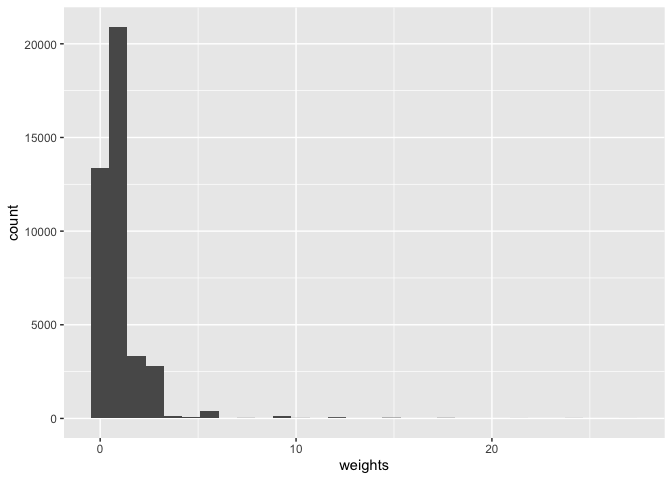<!-- -->

``` r
summary(full_data$weights)
```

```
##     Min.  1st Qu.   Median     Mean  3rd Qu.     Max. 
##  0.02438  0.37479  0.89950  1.00000  1.00000 26.98515
```

**Finding:** 

- The majority of the weights are concentrated around 1, meaning most participants 
contribute equally to the estimation.

- A few individuals have very high weights (e.g., greater than 8 or even 20).

- This kind of right-skewed distribution may raise concerns about extreme weights,
which can increase the variance of estimates and reduce robustness.


## Visualizing Matches: Comparing Two Matching Methods


``` r
love_knn <- love.plot(kkn_1_1, 
                binary = "std", 
                grid = TRUE,
                thresholds = c(m = .1),
                colors = c("red","blue"))

love_full <- love.plot(full, 
                binary = "std", 
                grid = TRUE,
                thresholds = c(m = .1),
                colors = c("red","blue"))

plot_grid(love_full, love_knn, ncol = 1, nrow = 2, labels = c('Full', 'KNN'))
```

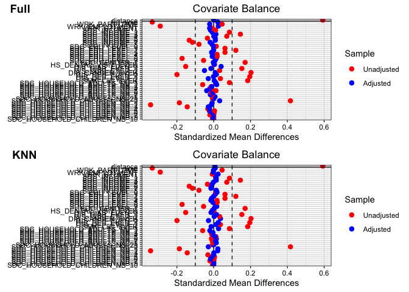<!-- -->

**Finding for both Plot:** 

- Before Matching (Red): 
   - Many red dots fall outside the ±0.1 bounds, showing substantial imbalance 
   between groups on several covariates.
   - This includes variables like __WRK_PART_TIME__, __WRK_EMPLOYMENT__, and 
   __SDC_INCOME6/7__,which are highly imbalanced before matching.
   
- After Matching (Blue)
   - All the blue dots are now within ±0.1, indicating that matching substantially 
   improved covariate balance.

- The distance variable
   - This shows the propensity score itself is well-balanced (blue dot is near zero), 
   which confirms the quality of the matching.
   

``` r
p1 <- bal.plot(full,
         var.name="distance",
         which="both",
         type = "density",
         colors = c("red","blue"))

p2 <- bal.plot(kkn_1_1,
         var.name="distance",
         which="both",
         type = "density",
         colors = c("red","blue"))


(p1 + ggtitle("Full")) / 
(p2 + ggtitle("KNN"))
```

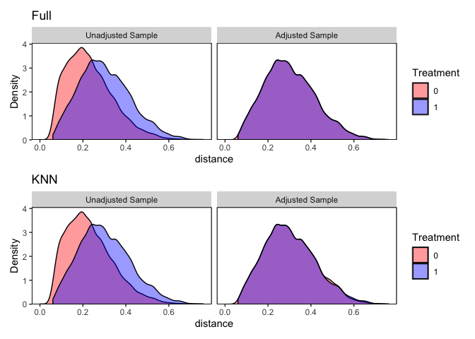<!-- -->

**Finding for both Plot:**

- Unadjusted Panels (Left side of both rows):
   - Noticeable separation between the red and blue curves.
   - This means that before matching, treated and control units had different 
   distributions of propensity scores.
   
- Adjusted Panels (Right side of both rows):
   - The red and blue curves almost completely overlap in both Full and KNN methods.
   - This indicates that matching successfully balanced the distribution of propensity scores.
   - The Full method appears to have slightly better balance than KNN methods.


## Analysis of the outcome and estimation of the treatment effect

We can then model the outcome in this dataset using the standard regression 
functions in R, like lm() or glm(), being sure to include the matching weights 
(stored in the weights variable of the match.data() output) in the estimation.

### Regression no covariates


``` r
table(full_data$arthritis)
```

```
## 
##     0     1 
## 30886 10301
```

``` r
full_data$arthritis <- as.numeric(full_data$arthritis)
full_data <- full_data %>%
	mutate(arthritis = case_when(
		arthritis == 1 ~ 0,
		arthritis == 2 ~ 1)) 
```

### GEE regresion 


``` r
fit_no_cov <- geeglm(arthritis ~ full_time, family=binomial("log"), 
              data=full_data,
              weights=weights, ### Weights
              std.err = 'san.se', ### Equivalent to robust standard errors 
              id=subclass, #### Group by subclasses
              corstr="independence") #### Specify correlation structure

# tab_model(fit_no_cov) # showing the result at the last section
```


## Inverse probability of treatment weighting (IPTW)


``` r
IPTW <- weightit(arthritis ~ full_time + WRK_PART_TIME + WRK_EMPLOYMENT + 
                   WRK_STUDENT + SDC_INCOME + SDC_EDU_LEVEL + SDC_GENDER + 
                   HS_DENTAL_VISIT_EVER + DIS_DIAB_EVER + DIS_CANCER_EVER + 
                   DIS_DEP_EVER + SMK_CIG_EVER +  SDC_HOUSEHOLD_ADULTS_NB + 
                   SDC_HOUSEHOLD_CHILDREN_NB,
                 data = data,
                 method = "glm", #using the default logistic regression;
                 stabilize = TRUE,
                 estimand = "ATE")

summary(IPTW)
```

```
##                   Summary of weights
## 
## - Weight ranges:
## 
##      Min                                  Max
## 0 0.7499     |--------------|          2.9473
## 1 0.3284 |---------------------------| 4.1508
## 
## - Units with the 5 most extreme weights by group:
##                                      
##     19795   5147  22728  24323  21823
##  0 2.6266 2.6493 2.6887 2.9473 2.9473
##     38384  36133  35664  25716  25612
##  1 4.1508 4.1508 4.1508 4.1508 4.1508
## 
## - Weight statistics:
## 
##   Coef of Var   MAD Entropy # Zeros
## 0       0.175 0.125   0.014       0
## 1       0.517 0.366   0.111       0
## 
## - Effective Sample Sizes:
## 
##                   0        1
## Unweighted 30886.   10301.  
## Weighted   29971.11  8131.53
```

**Finding:**

-  Weight Ranges:
   - Treated group (1): Weights range from 0.3289 to 4.2523.
   - Control group (0): Weights range from 0.7499 to 2.9002.

- Effective Sample Size (ESS):
   - Unweighted: 30,886 controls, 10,301 treated.
   - Weighted ESS:
     - Control: 29,967 (very close to full size, good overlap).
     - Treated: 8,130.72.


``` r
bal.plot(IPTW,
         which="both",
         type = "density",
         colors = c("red","blue"))
```

```
## No `var.name` was provided. Displaying balance for prop.score.
```

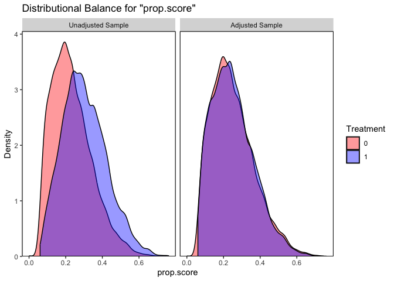<!-- -->
**Findings:**

- Unadjusted Sample (Left Panel): 
  - Noticeable separation between the red and blue curves.
  - This indicates that before weighting, the two groups had different distributions
  of propensity scores, meaning they differed systematically on observed covariates.
  
- Adjusted Sample (Right Panel):
  - After IPTW is applied, the red and blue curves almost completely overlap.
  - This shows that IPTW successfully balanced the covariate distributions between 
  treated and control groups.


``` r
model_iptw <- glm_weightit(arthritis ~ full_time, 
            family = "binomial",
            weightit = IPTW,
            data = data)
```

## Summary of Results for the Three Main Models


``` r
tab_model(fit_naive, fit_no_cov, model_iptw)
```

```
## Profiled confidence intervals may take longer time to compute.
##   Use `ci_method="wald"` for faster computation of CIs.
## Profiled confidence intervals may take longer time to compute.
##   Use `ci_method="wald"` for faster computation of CIs.
## Profiled confidence intervals may take longer time to compute.
##   Use `ci_method="wald"` for faster computation of CIs.
```

<table style="border-collapse:collapse; border:none;">
<tr>
<th style="border-top: double; text-align:center; font-style:normal; font-weight:bold; padding:0.2cm;  text-align:left; ">&nbsp;</th>
<th colspan="3" style="border-top: double; text-align:center; font-style:normal; font-weight:bold; padding:0.2cm; ">arthritis</th>
<th colspan="3" style="border-top: double; text-align:center; font-style:normal; font-weight:bold; padding:0.2cm; ">arthritis</th>
<th colspan="3" style="border-top: double; text-align:center; font-style:normal; font-weight:bold; padding:0.2cm; ">arthritis</th>
</tr>
<tr>
<td style=" text-align:center; border-bottom:1px solid; font-style:italic; font-weight:normal;  text-align:left; ">Predictors</td>
<td style=" text-align:center; border-bottom:1px solid; font-style:italic; font-weight:normal;  ">Odds Ratios</td>
<td style=" text-align:center; border-bottom:1px solid; font-style:italic; font-weight:normal;  ">CI</td>
<td style=" text-align:center; border-bottom:1px solid; font-style:italic; font-weight:normal;  ">p</td>
<td style=" text-align:center; border-bottom:1px solid; font-style:italic; font-weight:normal;  ">Risk Ratios</td>
<td style=" text-align:center; border-bottom:1px solid; font-style:italic; font-weight:normal;  ">CI</td>
<td style=" text-align:center; border-bottom:1px solid; font-style:italic; font-weight:normal;  col7">p</td>
<td style=" text-align:center; border-bottom:1px solid; font-style:italic; font-weight:normal;  col8">Odds Ratios</td>
<td style=" text-align:center; border-bottom:1px solid; font-style:italic; font-weight:normal;  col9">CI</td>
<td style=" text-align:center; border-bottom:1px solid; font-style:italic; font-weight:normal;  0">p</td>
</tr>
<tr>
<td style=" padding:0.2cm; text-align:left; vertical-align:top; text-align:left; ">(Intercept)</td>
<td style=" padding:0.2cm; text-align:left; vertical-align:top; text-align:center;  ">0.33</td>
<td style=" padding:0.2cm; text-align:left; vertical-align:top; text-align:center;  ">0.16&nbsp;&ndash;&nbsp;0.65</td>
<td style=" padding:0.2cm; text-align:left; vertical-align:top; text-align:center;  "><strong>0.002</strong></td>
<td style=" padding:0.2cm; text-align:left; vertical-align:top; text-align:center;  ">0.25</td>
<td style=" padding:0.2cm; text-align:left; vertical-align:top; text-align:center;  ">0.24&nbsp;&ndash;&nbsp;0.25</td>
<td style=" padding:0.2cm; text-align:left; vertical-align:top; text-align:center;  col7"><strong>&lt;0.001</strong></td>
<td style=" padding:0.2cm; text-align:left; vertical-align:top; text-align:center;  col8">0.33</td>
<td style=" padding:0.2cm; text-align:left; vertical-align:top; text-align:center;  col9">0.32&nbsp;&ndash;&nbsp;0.34</td>
<td style=" padding:0.2cm; text-align:left; vertical-align:top; text-align:center;  0"><strong>&lt;0.001</strong></td>
</tr>
<tr>
<td style=" padding:0.2cm; text-align:left; vertical-align:top; text-align:left; ">full time [1]</td>
<td style=" padding:0.2cm; text-align:left; vertical-align:top; text-align:center;  ">0.70</td>
<td style=" padding:0.2cm; text-align:left; vertical-align:top; text-align:center;  ">0.65&nbsp;&ndash;&nbsp;0.75</td>
<td style=" padding:0.2cm; text-align:left; vertical-align:top; text-align:center;  "><strong>&lt;0.001</strong></td>
<td style=" padding:0.2cm; text-align:left; vertical-align:top; text-align:center;  ">1.03</td>
<td style=" padding:0.2cm; text-align:left; vertical-align:top; text-align:center;  ">0.99&nbsp;&ndash;&nbsp;1.08</td>
<td style=" padding:0.2cm; text-align:left; vertical-align:top; text-align:center;  col7">0.098</td>
<td style=" padding:0.2cm; text-align:left; vertical-align:top; text-align:center;  col8">1.00</td>
<td style=" padding:0.2cm; text-align:left; vertical-align:top; text-align:center;  col9">0.98&nbsp;&ndash;&nbsp;1.01</td>
<td style=" padding:0.2cm; text-align:left; vertical-align:top; text-align:center;  0">0.785</td>
</tr>
<tr>
<td style=" padding:0.2cm; text-align:left; vertical-align:top; text-align:left; ">WRK PART TIME [1]</td>
<td style=" padding:0.2cm; text-align:left; vertical-align:top; text-align:center;  ">0.92</td>
<td style=" padding:0.2cm; text-align:left; vertical-align:top; text-align:center;  ">0.85&nbsp;&ndash;&nbsp;0.99</td>
<td style=" padding:0.2cm; text-align:left; vertical-align:top; text-align:center;  "><strong>0.031</strong></td>
<td style=" padding:0.2cm; text-align:left; vertical-align:top; text-align:center;  "></td>
<td style=" padding:0.2cm; text-align:left; vertical-align:top; text-align:center;  "></td>
<td style=" padding:0.2cm; text-align:left; vertical-align:top; text-align:center;  col7"></td>
<td style=" padding:0.2cm; text-align:left; vertical-align:top; text-align:center;  col8"></td>
<td style=" padding:0.2cm; text-align:left; vertical-align:top; text-align:center;  col9"></td>
<td style=" padding:0.2cm; text-align:left; vertical-align:top; text-align:center;  0"></td>
</tr>
<tr>
<td style=" padding:0.2cm; text-align:left; vertical-align:top; text-align:left; ">WRK EMPLOYMENT [1]</td>
<td style=" padding:0.2cm; text-align:left; vertical-align:top; text-align:center;  ">0.78</td>
<td style=" padding:0.2cm; text-align:left; vertical-align:top; text-align:center;  ">0.73&nbsp;&ndash;&nbsp;0.83</td>
<td style=" padding:0.2cm; text-align:left; vertical-align:top; text-align:center;  "><strong>&lt;0.001</strong></td>
<td style=" padding:0.2cm; text-align:left; vertical-align:top; text-align:center;  "></td>
<td style=" padding:0.2cm; text-align:left; vertical-align:top; text-align:center;  "></td>
<td style=" padding:0.2cm; text-align:left; vertical-align:top; text-align:center;  col7"></td>
<td style=" padding:0.2cm; text-align:left; vertical-align:top; text-align:center;  col8"></td>
<td style=" padding:0.2cm; text-align:left; vertical-align:top; text-align:center;  col9"></td>
<td style=" padding:0.2cm; text-align:left; vertical-align:top; text-align:center;  0"></td>
</tr>
<tr>
<td style=" padding:0.2cm; text-align:left; vertical-align:top; text-align:left; ">WRK STUDENT [1]</td>
<td style=" padding:0.2cm; text-align:left; vertical-align:top; text-align:center;  ">0.80</td>
<td style=" padding:0.2cm; text-align:left; vertical-align:top; text-align:center;  ">0.64&nbsp;&ndash;&nbsp;1.00</td>
<td style=" padding:0.2cm; text-align:left; vertical-align:top; text-align:center;  "><strong>0.049</strong></td>
<td style=" padding:0.2cm; text-align:left; vertical-align:top; text-align:center;  "></td>
<td style=" padding:0.2cm; text-align:left; vertical-align:top; text-align:center;  "></td>
<td style=" padding:0.2cm; text-align:left; vertical-align:top; text-align:center;  col7"></td>
<td style=" padding:0.2cm; text-align:left; vertical-align:top; text-align:center;  col8"></td>
<td style=" padding:0.2cm; text-align:left; vertical-align:top; text-align:center;  col9"></td>
<td style=" padding:0.2cm; text-align:left; vertical-align:top; text-align:center;  0"></td>
</tr>
<tr>
<td style=" padding:0.2cm; text-align:left; vertical-align:top; text-align:left; ">SDC INCOME [2]</td>
<td style=" padding:0.2cm; text-align:left; vertical-align:top; text-align:center;  ">1.27</td>
<td style=" padding:0.2cm; text-align:left; vertical-align:top; text-align:center;  ">1.03&nbsp;&ndash;&nbsp;1.57</td>
<td style=" padding:0.2cm; text-align:left; vertical-align:top; text-align:center;  "><strong>0.027</strong></td>
<td style=" padding:0.2cm; text-align:left; vertical-align:top; text-align:center;  "></td>
<td style=" padding:0.2cm; text-align:left; vertical-align:top; text-align:center;  "></td>
<td style=" padding:0.2cm; text-align:left; vertical-align:top; text-align:center;  col7"></td>
<td style=" padding:0.2cm; text-align:left; vertical-align:top; text-align:center;  col8"></td>
<td style=" padding:0.2cm; text-align:left; vertical-align:top; text-align:center;  col9"></td>
<td style=" padding:0.2cm; text-align:left; vertical-align:top; text-align:center;  0"></td>
</tr>
<tr>
<td style=" padding:0.2cm; text-align:left; vertical-align:top; text-align:left; ">SDC INCOME [3]</td>
<td style=" padding:0.2cm; text-align:left; vertical-align:top; text-align:center;  ">1.35</td>
<td style=" padding:0.2cm; text-align:left; vertical-align:top; text-align:center;  ">1.11&nbsp;&ndash;&nbsp;1.65</td>
<td style=" padding:0.2cm; text-align:left; vertical-align:top; text-align:center;  "><strong>0.003</strong></td>
<td style=" padding:0.2cm; text-align:left; vertical-align:top; text-align:center;  "></td>
<td style=" padding:0.2cm; text-align:left; vertical-align:top; text-align:center;  "></td>
<td style=" padding:0.2cm; text-align:left; vertical-align:top; text-align:center;  col7"></td>
<td style=" padding:0.2cm; text-align:left; vertical-align:top; text-align:center;  col8"></td>
<td style=" padding:0.2cm; text-align:left; vertical-align:top; text-align:center;  col9"></td>
<td style=" padding:0.2cm; text-align:left; vertical-align:top; text-align:center;  0"></td>
</tr>
<tr>
<td style=" padding:0.2cm; text-align:left; vertical-align:top; text-align:left; ">SDC INCOME [4]</td>
<td style=" padding:0.2cm; text-align:left; vertical-align:top; text-align:center;  ">1.28</td>
<td style=" padding:0.2cm; text-align:left; vertical-align:top; text-align:center;  ">1.05&nbsp;&ndash;&nbsp;1.56</td>
<td style=" padding:0.2cm; text-align:left; vertical-align:top; text-align:center;  "><strong>0.016</strong></td>
<td style=" padding:0.2cm; text-align:left; vertical-align:top; text-align:center;  "></td>
<td style=" padding:0.2cm; text-align:left; vertical-align:top; text-align:center;  "></td>
<td style=" padding:0.2cm; text-align:left; vertical-align:top; text-align:center;  col7"></td>
<td style=" padding:0.2cm; text-align:left; vertical-align:top; text-align:center;  col8"></td>
<td style=" padding:0.2cm; text-align:left; vertical-align:top; text-align:center;  col9"></td>
<td style=" padding:0.2cm; text-align:left; vertical-align:top; text-align:center;  0"></td>
</tr>
<tr>
<td style=" padding:0.2cm; text-align:left; vertical-align:top; text-align:left; ">SDC INCOME [5]</td>
<td style=" padding:0.2cm; text-align:left; vertical-align:top; text-align:center;  ">1.16</td>
<td style=" padding:0.2cm; text-align:left; vertical-align:top; text-align:center;  ">0.95&nbsp;&ndash;&nbsp;1.42</td>
<td style=" padding:0.2cm; text-align:left; vertical-align:top; text-align:center;  ">0.141</td>
<td style=" padding:0.2cm; text-align:left; vertical-align:top; text-align:center;  "></td>
<td style=" padding:0.2cm; text-align:left; vertical-align:top; text-align:center;  "></td>
<td style=" padding:0.2cm; text-align:left; vertical-align:top; text-align:center;  col7"></td>
<td style=" padding:0.2cm; text-align:left; vertical-align:top; text-align:center;  col8"></td>
<td style=" padding:0.2cm; text-align:left; vertical-align:top; text-align:center;  col9"></td>
<td style=" padding:0.2cm; text-align:left; vertical-align:top; text-align:center;  0"></td>
</tr>
<tr>
<td style=" padding:0.2cm; text-align:left; vertical-align:top; text-align:left; ">SDC INCOME [6]</td>
<td style=" padding:0.2cm; text-align:left; vertical-align:top; text-align:center;  ">1.08</td>
<td style=" padding:0.2cm; text-align:left; vertical-align:top; text-align:center;  ">0.89&nbsp;&ndash;&nbsp;1.33</td>
<td style=" padding:0.2cm; text-align:left; vertical-align:top; text-align:center;  ">0.443</td>
<td style=" padding:0.2cm; text-align:left; vertical-align:top; text-align:center;  "></td>
<td style=" padding:0.2cm; text-align:left; vertical-align:top; text-align:center;  "></td>
<td style=" padding:0.2cm; text-align:left; vertical-align:top; text-align:center;  col7"></td>
<td style=" padding:0.2cm; text-align:left; vertical-align:top; text-align:center;  col8"></td>
<td style=" padding:0.2cm; text-align:left; vertical-align:top; text-align:center;  col9"></td>
<td style=" padding:0.2cm; text-align:left; vertical-align:top; text-align:center;  0"></td>
</tr>
<tr>
<td style=" padding:0.2cm; text-align:left; vertical-align:top; text-align:left; ">SDC INCOME [7]</td>
<td style=" padding:0.2cm; text-align:left; vertical-align:top; text-align:center;  ">1.06</td>
<td style=" padding:0.2cm; text-align:left; vertical-align:top; text-align:center;  ">0.86&nbsp;&ndash;&nbsp;1.32</td>
<td style=" padding:0.2cm; text-align:left; vertical-align:top; text-align:center;  ">0.560</td>
<td style=" padding:0.2cm; text-align:left; vertical-align:top; text-align:center;  "></td>
<td style=" padding:0.2cm; text-align:left; vertical-align:top; text-align:center;  "></td>
<td style=" padding:0.2cm; text-align:left; vertical-align:top; text-align:center;  col7"></td>
<td style=" padding:0.2cm; text-align:left; vertical-align:top; text-align:center;  col8"></td>
<td style=" padding:0.2cm; text-align:left; vertical-align:top; text-align:center;  col9"></td>
<td style=" padding:0.2cm; text-align:left; vertical-align:top; text-align:center;  0"></td>
</tr>
<tr>
<td style=" padding:0.2cm; text-align:left; vertical-align:top; text-align:left; ">SDC INCOME [8]</td>
<td style=" padding:0.2cm; text-align:left; vertical-align:top; text-align:center;  ">1.11</td>
<td style=" padding:0.2cm; text-align:left; vertical-align:top; text-align:center;  ">0.89&nbsp;&ndash;&nbsp;1.38</td>
<td style=" padding:0.2cm; text-align:left; vertical-align:top; text-align:center;  ">0.353</td>
<td style=" padding:0.2cm; text-align:left; vertical-align:top; text-align:center;  "></td>
<td style=" padding:0.2cm; text-align:left; vertical-align:top; text-align:center;  "></td>
<td style=" padding:0.2cm; text-align:left; vertical-align:top; text-align:center;  col7"></td>
<td style=" padding:0.2cm; text-align:left; vertical-align:top; text-align:center;  col8"></td>
<td style=" padding:0.2cm; text-align:left; vertical-align:top; text-align:center;  col9"></td>
<td style=" padding:0.2cm; text-align:left; vertical-align:top; text-align:center;  0"></td>
</tr>
<tr>
<td style=" padding:0.2cm; text-align:left; vertical-align:top; text-align:left; ">SDC EDU LEVEL [1]</td>
<td style=" padding:0.2cm; text-align:left; vertical-align:top; text-align:center;  ">1.13</td>
<td style=" padding:0.2cm; text-align:left; vertical-align:top; text-align:center;  ">0.68&nbsp;&ndash;&nbsp;1.94</td>
<td style=" padding:0.2cm; text-align:left; vertical-align:top; text-align:center;  ">0.635</td>
<td style=" padding:0.2cm; text-align:left; vertical-align:top; text-align:center;  "></td>
<td style=" padding:0.2cm; text-align:left; vertical-align:top; text-align:center;  "></td>
<td style=" padding:0.2cm; text-align:left; vertical-align:top; text-align:center;  col7"></td>
<td style=" padding:0.2cm; text-align:left; vertical-align:top; text-align:center;  col8"></td>
<td style=" padding:0.2cm; text-align:left; vertical-align:top; text-align:center;  col9"></td>
<td style=" padding:0.2cm; text-align:left; vertical-align:top; text-align:center;  0"></td>
</tr>
<tr>
<td style=" padding:0.2cm; text-align:left; vertical-align:top; text-align:left; ">SDC EDU LEVEL [2]</td>
<td style=" padding:0.2cm; text-align:left; vertical-align:top; text-align:center;  ">0.90</td>
<td style=" padding:0.2cm; text-align:left; vertical-align:top; text-align:center;  ">0.55&nbsp;&ndash;&nbsp;1.49</td>
<td style=" padding:0.2cm; text-align:left; vertical-align:top; text-align:center;  ">0.661</td>
<td style=" padding:0.2cm; text-align:left; vertical-align:top; text-align:center;  "></td>
<td style=" padding:0.2cm; text-align:left; vertical-align:top; text-align:center;  "></td>
<td style=" padding:0.2cm; text-align:left; vertical-align:top; text-align:center;  col7"></td>
<td style=" padding:0.2cm; text-align:left; vertical-align:top; text-align:center;  col8"></td>
<td style=" padding:0.2cm; text-align:left; vertical-align:top; text-align:center;  col9"></td>
<td style=" padding:0.2cm; text-align:left; vertical-align:top; text-align:center;  0"></td>
</tr>
<tr>
<td style=" padding:0.2cm; text-align:left; vertical-align:top; text-align:left; ">SDC EDU LEVEL [3]</td>
<td style=" padding:0.2cm; text-align:left; vertical-align:top; text-align:center;  ">0.92</td>
<td style=" padding:0.2cm; text-align:left; vertical-align:top; text-align:center;  ">0.56&nbsp;&ndash;&nbsp;1.53</td>
<td style=" padding:0.2cm; text-align:left; vertical-align:top; text-align:center;  ">0.732</td>
<td style=" padding:0.2cm; text-align:left; vertical-align:top; text-align:center;  "></td>
<td style=" padding:0.2cm; text-align:left; vertical-align:top; text-align:center;  "></td>
<td style=" padding:0.2cm; text-align:left; vertical-align:top; text-align:center;  col7"></td>
<td style=" padding:0.2cm; text-align:left; vertical-align:top; text-align:center;  col8"></td>
<td style=" padding:0.2cm; text-align:left; vertical-align:top; text-align:center;  col9"></td>
<td style=" padding:0.2cm; text-align:left; vertical-align:top; text-align:center;  0"></td>
</tr>
<tr>
<td style=" padding:0.2cm; text-align:left; vertical-align:top; text-align:left; ">SDC EDU LEVEL [4]</td>
<td style=" padding:0.2cm; text-align:left; vertical-align:top; text-align:center;  ">0.81</td>
<td style=" padding:0.2cm; text-align:left; vertical-align:top; text-align:center;  ">0.50&nbsp;&ndash;&nbsp;1.34</td>
<td style=" padding:0.2cm; text-align:left; vertical-align:top; text-align:center;  ">0.398</td>
<td style=" padding:0.2cm; text-align:left; vertical-align:top; text-align:center;  "></td>
<td style=" padding:0.2cm; text-align:left; vertical-align:top; text-align:center;  "></td>
<td style=" padding:0.2cm; text-align:left; vertical-align:top; text-align:center;  col7"></td>
<td style=" padding:0.2cm; text-align:left; vertical-align:top; text-align:center;  col8"></td>
<td style=" padding:0.2cm; text-align:left; vertical-align:top; text-align:center;  col9"></td>
<td style=" padding:0.2cm; text-align:left; vertical-align:top; text-align:center;  0"></td>
</tr>
<tr>
<td style=" padding:0.2cm; text-align:left; vertical-align:top; text-align:left; ">SDC EDU LEVEL [5]</td>
<td style=" padding:0.2cm; text-align:left; vertical-align:top; text-align:center;  ">0.82</td>
<td style=" padding:0.2cm; text-align:left; vertical-align:top; text-align:center;  ">0.50&nbsp;&ndash;&nbsp;1.38</td>
<td style=" padding:0.2cm; text-align:left; vertical-align:top; text-align:center;  ">0.450</td>
<td style=" padding:0.2cm; text-align:left; vertical-align:top; text-align:center;  "></td>
<td style=" padding:0.2cm; text-align:left; vertical-align:top; text-align:center;  "></td>
<td style=" padding:0.2cm; text-align:left; vertical-align:top; text-align:center;  col7"></td>
<td style=" padding:0.2cm; text-align:left; vertical-align:top; text-align:center;  col8"></td>
<td style=" padding:0.2cm; text-align:left; vertical-align:top; text-align:center;  col9"></td>
<td style=" padding:0.2cm; text-align:left; vertical-align:top; text-align:center;  0"></td>
</tr>
<tr>
<td style=" padding:0.2cm; text-align:left; vertical-align:top; text-align:left; ">SDC EDU LEVEL [6]</td>
<td style=" padding:0.2cm; text-align:left; vertical-align:top; text-align:center;  ">0.67</td>
<td style=" padding:0.2cm; text-align:left; vertical-align:top; text-align:center;  ">0.41&nbsp;&ndash;&nbsp;1.12</td>
<td style=" padding:0.2cm; text-align:left; vertical-align:top; text-align:center;  ">0.115</td>
<td style=" padding:0.2cm; text-align:left; vertical-align:top; text-align:center;  "></td>
<td style=" padding:0.2cm; text-align:left; vertical-align:top; text-align:center;  "></td>
<td style=" padding:0.2cm; text-align:left; vertical-align:top; text-align:center;  col7"></td>
<td style=" padding:0.2cm; text-align:left; vertical-align:top; text-align:center;  col8"></td>
<td style=" padding:0.2cm; text-align:left; vertical-align:top; text-align:center;  col9"></td>
<td style=" padding:0.2cm; text-align:left; vertical-align:top; text-align:center;  0"></td>
</tr>
<tr>
<td style=" padding:0.2cm; text-align:left; vertical-align:top; text-align:left; ">SDC EDU LEVEL [7]</td>
<td style=" padding:0.2cm; text-align:left; vertical-align:top; text-align:center;  ">0.77</td>
<td style=" padding:0.2cm; text-align:left; vertical-align:top; text-align:center;  ">0.48&nbsp;&ndash;&nbsp;1.29</td>
<td style=" padding:0.2cm; text-align:left; vertical-align:top; text-align:center;  ">0.311</td>
<td style=" padding:0.2cm; text-align:left; vertical-align:top; text-align:center;  "></td>
<td style=" padding:0.2cm; text-align:left; vertical-align:top; text-align:center;  "></td>
<td style=" padding:0.2cm; text-align:left; vertical-align:top; text-align:center;  col7"></td>
<td style=" padding:0.2cm; text-align:left; vertical-align:top; text-align:center;  col8"></td>
<td style=" padding:0.2cm; text-align:left; vertical-align:top; text-align:center;  col9"></td>
<td style=" padding:0.2cm; text-align:left; vertical-align:top; text-align:center;  0"></td>
</tr>
<tr>
<td style=" padding:0.2cm; text-align:left; vertical-align:top; text-align:left; ">SDC GENDER [2]</td>
<td style=" padding:0.2cm; text-align:left; vertical-align:top; text-align:center;  ">1.38</td>
<td style=" padding:0.2cm; text-align:left; vertical-align:top; text-align:center;  ">1.31&nbsp;&ndash;&nbsp;1.45</td>
<td style=" padding:0.2cm; text-align:left; vertical-align:top; text-align:center;  "><strong>&lt;0.001</strong></td>
<td style=" padding:0.2cm; text-align:left; vertical-align:top; text-align:center;  "></td>
<td style=" padding:0.2cm; text-align:left; vertical-align:top; text-align:center;  "></td>
<td style=" padding:0.2cm; text-align:left; vertical-align:top; text-align:center;  col7"></td>
<td style=" padding:0.2cm; text-align:left; vertical-align:top; text-align:center;  col8"></td>
<td style=" padding:0.2cm; text-align:left; vertical-align:top; text-align:center;  col9"></td>
<td style=" padding:0.2cm; text-align:left; vertical-align:top; text-align:center;  0"></td>
</tr>
<tr>
<td style=" padding:0.2cm; text-align:left; vertical-align:top; text-align:left; ">HS DENTAL VISIT EVER [1]</td>
<td style=" padding:0.2cm; text-align:left; vertical-align:top; text-align:center;  ">1.13</td>
<td style=" padding:0.2cm; text-align:left; vertical-align:top; text-align:center;  ">0.73&nbsp;&ndash;&nbsp;1.82</td>
<td style=" padding:0.2cm; text-align:left; vertical-align:top; text-align:center;  ">0.588</td>
<td style=" padding:0.2cm; text-align:left; vertical-align:top; text-align:center;  "></td>
<td style=" padding:0.2cm; text-align:left; vertical-align:top; text-align:center;  "></td>
<td style=" padding:0.2cm; text-align:left; vertical-align:top; text-align:center;  col7"></td>
<td style=" padding:0.2cm; text-align:left; vertical-align:top; text-align:center;  col8"></td>
<td style=" padding:0.2cm; text-align:left; vertical-align:top; text-align:center;  col9"></td>
<td style=" padding:0.2cm; text-align:left; vertical-align:top; text-align:center;  0"></td>
</tr>
<tr>
<td style=" padding:0.2cm; text-align:left; vertical-align:top; text-align:left; ">DIS DIAB EVER [1]</td>
<td style=" padding:0.2cm; text-align:left; vertical-align:top; text-align:center;  ">1.56</td>
<td style=" padding:0.2cm; text-align:left; vertical-align:top; text-align:center;  ">1.44&nbsp;&ndash;&nbsp;1.69</td>
<td style=" padding:0.2cm; text-align:left; vertical-align:top; text-align:center;  "><strong>&lt;0.001</strong></td>
<td style=" padding:0.2cm; text-align:left; vertical-align:top; text-align:center;  "></td>
<td style=" padding:0.2cm; text-align:left; vertical-align:top; text-align:center;  "></td>
<td style=" padding:0.2cm; text-align:left; vertical-align:top; text-align:center;  col7"></td>
<td style=" padding:0.2cm; text-align:left; vertical-align:top; text-align:center;  col8"></td>
<td style=" padding:0.2cm; text-align:left; vertical-align:top; text-align:center;  col9"></td>
<td style=" padding:0.2cm; text-align:left; vertical-align:top; text-align:center;  0"></td>
</tr>
<tr>
<td style=" padding:0.2cm; text-align:left; vertical-align:top; text-align:left; ">DIS DIAB EVER [2]</td>
<td style=" padding:0.2cm; text-align:left; vertical-align:top; text-align:center;  ">0.95</td>
<td style=" padding:0.2cm; text-align:left; vertical-align:top; text-align:center;  ">0.82&nbsp;&ndash;&nbsp;1.10</td>
<td style=" padding:0.2cm; text-align:left; vertical-align:top; text-align:center;  ">0.477</td>
<td style=" padding:0.2cm; text-align:left; vertical-align:top; text-align:center;  "></td>
<td style=" padding:0.2cm; text-align:left; vertical-align:top; text-align:center;  "></td>
<td style=" padding:0.2cm; text-align:left; vertical-align:top; text-align:center;  col7"></td>
<td style=" padding:0.2cm; text-align:left; vertical-align:top; text-align:center;  col8"></td>
<td style=" padding:0.2cm; text-align:left; vertical-align:top; text-align:center;  col9"></td>
<td style=" padding:0.2cm; text-align:left; vertical-align:top; text-align:center;  0"></td>
</tr>
<tr>
<td style=" padding:0.2cm; text-align:left; vertical-align:top; text-align:left; ">DIS CANCER EVER [1]</td>
<td style=" padding:0.2cm; text-align:left; vertical-align:top; text-align:center;  ">1.56</td>
<td style=" padding:0.2cm; text-align:left; vertical-align:top; text-align:center;  ">1.46&nbsp;&ndash;&nbsp;1.67</td>
<td style=" padding:0.2cm; text-align:left; vertical-align:top; text-align:center;  "><strong>&lt;0.001</strong></td>
<td style=" padding:0.2cm; text-align:left; vertical-align:top; text-align:center;  "></td>
<td style=" padding:0.2cm; text-align:left; vertical-align:top; text-align:center;  "></td>
<td style=" padding:0.2cm; text-align:left; vertical-align:top; text-align:center;  col7"></td>
<td style=" padding:0.2cm; text-align:left; vertical-align:top; text-align:center;  col8"></td>
<td style=" padding:0.2cm; text-align:left; vertical-align:top; text-align:center;  col9"></td>
<td style=" padding:0.2cm; text-align:left; vertical-align:top; text-align:center;  0"></td>
</tr>
<tr>
<td style=" padding:0.2cm; text-align:left; vertical-align:top; text-align:left; ">DIS DEP EVER [1]</td>
<td style=" padding:0.2cm; text-align:left; vertical-align:top; text-align:center;  ">1.67</td>
<td style=" padding:0.2cm; text-align:left; vertical-align:top; text-align:center;  ">1.57&nbsp;&ndash;&nbsp;1.78</td>
<td style=" padding:0.2cm; text-align:left; vertical-align:top; text-align:center;  "><strong>&lt;0.001</strong></td>
<td style=" padding:0.2cm; text-align:left; vertical-align:top; text-align:center;  "></td>
<td style=" padding:0.2cm; text-align:left; vertical-align:top; text-align:center;  "></td>
<td style=" padding:0.2cm; text-align:left; vertical-align:top; text-align:center;  col7"></td>
<td style=" padding:0.2cm; text-align:left; vertical-align:top; text-align:center;  col8"></td>
<td style=" padding:0.2cm; text-align:left; vertical-align:top; text-align:center;  col9"></td>
<td style=" padding:0.2cm; text-align:left; vertical-align:top; text-align:center;  0"></td>
</tr>
<tr>
<td style=" padding:0.2cm; text-align:left; vertical-align:top; text-align:left; ">DIS DEP EVER [2]</td>
<td style=" padding:0.2cm; text-align:left; vertical-align:top; text-align:center;  ">1.11</td>
<td style=" padding:0.2cm; text-align:left; vertical-align:top; text-align:center;  ">0.95&nbsp;&ndash;&nbsp;1.29</td>
<td style=" padding:0.2cm; text-align:left; vertical-align:top; text-align:center;  ">0.187</td>
<td style=" padding:0.2cm; text-align:left; vertical-align:top; text-align:center;  "></td>
<td style=" padding:0.2cm; text-align:left; vertical-align:top; text-align:center;  "></td>
<td style=" padding:0.2cm; text-align:left; vertical-align:top; text-align:center;  col7"></td>
<td style=" padding:0.2cm; text-align:left; vertical-align:top; text-align:center;  col8"></td>
<td style=" padding:0.2cm; text-align:left; vertical-align:top; text-align:center;  col9"></td>
<td style=" padding:0.2cm; text-align:left; vertical-align:top; text-align:center;  0"></td>
</tr>
<tr>
<td style=" padding:0.2cm; text-align:left; vertical-align:top; text-align:left; ">SMK CIG EVER [1]</td>
<td style=" padding:0.2cm; text-align:left; vertical-align:top; text-align:center;  ">1.24</td>
<td style=" padding:0.2cm; text-align:left; vertical-align:top; text-align:center;  ">1.19&nbsp;&ndash;&nbsp;1.30</td>
<td style=" padding:0.2cm; text-align:left; vertical-align:top; text-align:center;  "><strong>&lt;0.001</strong></td>
<td style=" padding:0.2cm; text-align:left; vertical-align:top; text-align:center;  "></td>
<td style=" padding:0.2cm; text-align:left; vertical-align:top; text-align:center;  "></td>
<td style=" padding:0.2cm; text-align:left; vertical-align:top; text-align:center;  col7"></td>
<td style=" padding:0.2cm; text-align:left; vertical-align:top; text-align:center;  col8"></td>
<td style=" padding:0.2cm; text-align:left; vertical-align:top; text-align:center;  col9"></td>
<td style=" padding:0.2cm; text-align:left; vertical-align:top; text-align:center;  0"></td>
</tr>
<tr>
<td style=" padding:0.2cm; text-align:left; vertical-align:top; text-align:left; ">SDC HOUSEHOLD ADULTS NB<br>[2]</td>
<td style=" padding:0.2cm; text-align:left; vertical-align:top; text-align:center;  ">1.00</td>
<td style=" padding:0.2cm; text-align:left; vertical-align:top; text-align:center;  ">0.94&nbsp;&ndash;&nbsp;1.06</td>
<td style=" padding:0.2cm; text-align:left; vertical-align:top; text-align:center;  ">0.946</td>
<td style=" padding:0.2cm; text-align:left; vertical-align:top; text-align:center;  "></td>
<td style=" padding:0.2cm; text-align:left; vertical-align:top; text-align:center;  "></td>
<td style=" padding:0.2cm; text-align:left; vertical-align:top; text-align:center;  col7"></td>
<td style=" padding:0.2cm; text-align:left; vertical-align:top; text-align:center;  col8"></td>
<td style=" padding:0.2cm; text-align:left; vertical-align:top; text-align:center;  col9"></td>
<td style=" padding:0.2cm; text-align:left; vertical-align:top; text-align:center;  0"></td>
</tr>
<tr>
<td style=" padding:0.2cm; text-align:left; vertical-align:top; text-align:left; ">SDC HOUSEHOLD ADULTS NB<br>[3]</td>
<td style=" padding:0.2cm; text-align:left; vertical-align:top; text-align:center;  ">1.01</td>
<td style=" padding:0.2cm; text-align:left; vertical-align:top; text-align:center;  ">0.93&nbsp;&ndash;&nbsp;1.10</td>
<td style=" padding:0.2cm; text-align:left; vertical-align:top; text-align:center;  ">0.750</td>
<td style=" padding:0.2cm; text-align:left; vertical-align:top; text-align:center;  "></td>
<td style=" padding:0.2cm; text-align:left; vertical-align:top; text-align:center;  "></td>
<td style=" padding:0.2cm; text-align:left; vertical-align:top; text-align:center;  col7"></td>
<td style=" padding:0.2cm; text-align:left; vertical-align:top; text-align:center;  col8"></td>
<td style=" padding:0.2cm; text-align:left; vertical-align:top; text-align:center;  col9"></td>
<td style=" padding:0.2cm; text-align:left; vertical-align:top; text-align:center;  0"></td>
</tr>
<tr>
<td style=" padding:0.2cm; text-align:left; vertical-align:top; text-align:left; ">SDC HOUSEHOLD ADULTS NB<br>[4]</td>
<td style=" padding:0.2cm; text-align:left; vertical-align:top; text-align:center;  ">1.01</td>
<td style=" padding:0.2cm; text-align:left; vertical-align:top; text-align:center;  ">0.90&nbsp;&ndash;&nbsp;1.13</td>
<td style=" padding:0.2cm; text-align:left; vertical-align:top; text-align:center;  ">0.886</td>
<td style=" padding:0.2cm; text-align:left; vertical-align:top; text-align:center;  "></td>
<td style=" padding:0.2cm; text-align:left; vertical-align:top; text-align:center;  "></td>
<td style=" padding:0.2cm; text-align:left; vertical-align:top; text-align:center;  col7"></td>
<td style=" padding:0.2cm; text-align:left; vertical-align:top; text-align:center;  col8"></td>
<td style=" padding:0.2cm; text-align:left; vertical-align:top; text-align:center;  col9"></td>
<td style=" padding:0.2cm; text-align:left; vertical-align:top; text-align:center;  0"></td>
</tr>
<tr>
<td style=" padding:0.2cm; text-align:left; vertical-align:top; text-align:left; ">SDC HOUSEHOLD ADULTS NB<br>[5]</td>
<td style=" padding:0.2cm; text-align:left; vertical-align:top; text-align:center;  ">1.19</td>
<td style=" padding:0.2cm; text-align:left; vertical-align:top; text-align:center;  ">0.95&nbsp;&ndash;&nbsp;1.48</td>
<td style=" padding:0.2cm; text-align:left; vertical-align:top; text-align:center;  ">0.131</td>
<td style=" padding:0.2cm; text-align:left; vertical-align:top; text-align:center;  "></td>
<td style=" padding:0.2cm; text-align:left; vertical-align:top; text-align:center;  "></td>
<td style=" padding:0.2cm; text-align:left; vertical-align:top; text-align:center;  col7"></td>
<td style=" padding:0.2cm; text-align:left; vertical-align:top; text-align:center;  col8"></td>
<td style=" padding:0.2cm; text-align:left; vertical-align:top; text-align:center;  col9"></td>
<td style=" padding:0.2cm; text-align:left; vertical-align:top; text-align:center;  0"></td>
</tr>
<tr>
<td style=" padding:0.2cm; text-align:left; vertical-align:top; text-align:left; ">SDC HOUSEHOLD ADULTS NB<br>[6]</td>
<td style=" padding:0.2cm; text-align:left; vertical-align:top; text-align:center;  ">0.86</td>
<td style=" padding:0.2cm; text-align:left; vertical-align:top; text-align:center;  ">0.43&nbsp;&ndash;&nbsp;1.60</td>
<td style=" padding:0.2cm; text-align:left; vertical-align:top; text-align:center;  ">0.662</td>
<td style=" padding:0.2cm; text-align:left; vertical-align:top; text-align:center;  "></td>
<td style=" padding:0.2cm; text-align:left; vertical-align:top; text-align:center;  "></td>
<td style=" padding:0.2cm; text-align:left; vertical-align:top; text-align:center;  col7"></td>
<td style=" padding:0.2cm; text-align:left; vertical-align:top; text-align:center;  col8"></td>
<td style=" padding:0.2cm; text-align:left; vertical-align:top; text-align:center;  col9"></td>
<td style=" padding:0.2cm; text-align:left; vertical-align:top; text-align:center;  0"></td>
</tr>
<tr>
<td style=" padding:0.2cm; text-align:left; vertical-align:top; text-align:left; ">SDC HOUSEHOLD ADULTS NB<br>[7]</td>
<td style=" padding:0.2cm; text-align:left; vertical-align:top; text-align:center;  ">0.71</td>
<td style=" padding:0.2cm; text-align:left; vertical-align:top; text-align:center;  ">0.20&nbsp;&ndash;&nbsp;1.96</td>
<td style=" padding:0.2cm; text-align:left; vertical-align:top; text-align:center;  ">0.538</td>
<td style=" padding:0.2cm; text-align:left; vertical-align:top; text-align:center;  "></td>
<td style=" padding:0.2cm; text-align:left; vertical-align:top; text-align:center;  "></td>
<td style=" padding:0.2cm; text-align:left; vertical-align:top; text-align:center;  col7"></td>
<td style=" padding:0.2cm; text-align:left; vertical-align:top; text-align:center;  col8"></td>
<td style=" padding:0.2cm; text-align:left; vertical-align:top; text-align:center;  col9"></td>
<td style=" padding:0.2cm; text-align:left; vertical-align:top; text-align:center;  0"></td>
</tr>
<tr>
<td style=" padding:0.2cm; text-align:left; vertical-align:top; text-align:left; ">SDC HOUSEHOLD ADULTS NB<br>[8]</td>
<td style=" padding:0.2cm; text-align:left; vertical-align:top; text-align:center;  ">0.68</td>
<td style=" padding:0.2cm; text-align:left; vertical-align:top; text-align:center;  ">0.10&nbsp;&ndash;&nbsp;2.85</td>
<td style=" padding:0.2cm; text-align:left; vertical-align:top; text-align:center;  ">0.636</td>
<td style=" padding:0.2cm; text-align:left; vertical-align:top; text-align:center;  "></td>
<td style=" padding:0.2cm; text-align:left; vertical-align:top; text-align:center;  "></td>
<td style=" padding:0.2cm; text-align:left; vertical-align:top; text-align:center;  col7"></td>
<td style=" padding:0.2cm; text-align:left; vertical-align:top; text-align:center;  col8"></td>
<td style=" padding:0.2cm; text-align:left; vertical-align:top; text-align:center;  col9"></td>
<td style=" padding:0.2cm; text-align:left; vertical-align:top; text-align:center;  0"></td>
</tr>
<tr>
<td style=" padding:0.2cm; text-align:left; vertical-align:top; text-align:left; ">SDC HOUSEHOLD ADULTS NB<br>[21]</td>
<td style=" padding:0.2cm; text-align:left; vertical-align:top; text-align:center;  ">0.00</td>
<td style=" padding:0.2cm; text-align:left; vertical-align:top; text-align:center;  ">NA&nbsp;&ndash;&nbsp;10461145362217.71</td>
<td style=" padding:0.2cm; text-align:left; vertical-align:top; text-align:center;  ">0.959</td>
<td style=" padding:0.2cm; text-align:left; vertical-align:top; text-align:center;  "></td>
<td style=" padding:0.2cm; text-align:left; vertical-align:top; text-align:center;  "></td>
<td style=" padding:0.2cm; text-align:left; vertical-align:top; text-align:center;  col7"></td>
<td style=" padding:0.2cm; text-align:left; vertical-align:top; text-align:center;  col8"></td>
<td style=" padding:0.2cm; text-align:left; vertical-align:top; text-align:center;  col9"></td>
<td style=" padding:0.2cm; text-align:left; vertical-align:top; text-align:center;  0"></td>
</tr>
<tr>
<td style=" padding:0.2cm; text-align:left; vertical-align:top; text-align:left; ">SDC HOUSEHOLD CHILDREN NB<br>[1]</td>
<td style=" padding:0.2cm; text-align:left; vertical-align:top; text-align:center;  ">0.59</td>
<td style=" padding:0.2cm; text-align:left; vertical-align:top; text-align:center;  ">0.54&nbsp;&ndash;&nbsp;0.63</td>
<td style=" padding:0.2cm; text-align:left; vertical-align:top; text-align:center;  "><strong>&lt;0.001</strong></td>
<td style=" padding:0.2cm; text-align:left; vertical-align:top; text-align:center;  "></td>
<td style=" padding:0.2cm; text-align:left; vertical-align:top; text-align:center;  "></td>
<td style=" padding:0.2cm; text-align:left; vertical-align:top; text-align:center;  col7"></td>
<td style=" padding:0.2cm; text-align:left; vertical-align:top; text-align:center;  col8"></td>
<td style=" padding:0.2cm; text-align:left; vertical-align:top; text-align:center;  col9"></td>
<td style=" padding:0.2cm; text-align:left; vertical-align:top; text-align:center;  0"></td>
</tr>
<tr>
<td style=" padding:0.2cm; text-align:left; vertical-align:top; text-align:left; ">SDC HOUSEHOLD CHILDREN NB<br>[2]</td>
<td style=" padding:0.2cm; text-align:left; vertical-align:top; text-align:center;  ">0.44</td>
<td style=" padding:0.2cm; text-align:left; vertical-align:top; text-align:center;  ">0.40&nbsp;&ndash;&nbsp;0.48</td>
<td style=" padding:0.2cm; text-align:left; vertical-align:top; text-align:center;  "><strong>&lt;0.001</strong></td>
<td style=" padding:0.2cm; text-align:left; vertical-align:top; text-align:center;  "></td>
<td style=" padding:0.2cm; text-align:left; vertical-align:top; text-align:center;  "></td>
<td style=" padding:0.2cm; text-align:left; vertical-align:top; text-align:center;  col7"></td>
<td style=" padding:0.2cm; text-align:left; vertical-align:top; text-align:center;  col8"></td>
<td style=" padding:0.2cm; text-align:left; vertical-align:top; text-align:center;  col9"></td>
<td style=" padding:0.2cm; text-align:left; vertical-align:top; text-align:center;  0"></td>
</tr>
<tr>
<td style=" padding:0.2cm; text-align:left; vertical-align:top; text-align:left; ">SDC HOUSEHOLD CHILDREN NB<br>[3]</td>
<td style=" padding:0.2cm; text-align:left; vertical-align:top; text-align:center;  ">0.48</td>
<td style=" padding:0.2cm; text-align:left; vertical-align:top; text-align:center;  ">0.41&nbsp;&ndash;&nbsp;0.55</td>
<td style=" padding:0.2cm; text-align:left; vertical-align:top; text-align:center;  "><strong>&lt;0.001</strong></td>
<td style=" padding:0.2cm; text-align:left; vertical-align:top; text-align:center;  "></td>
<td style=" padding:0.2cm; text-align:left; vertical-align:top; text-align:center;  "></td>
<td style=" padding:0.2cm; text-align:left; vertical-align:top; text-align:center;  col7"></td>
<td style=" padding:0.2cm; text-align:left; vertical-align:top; text-align:center;  col8"></td>
<td style=" padding:0.2cm; text-align:left; vertical-align:top; text-align:center;  col9"></td>
<td style=" padding:0.2cm; text-align:left; vertical-align:top; text-align:center;  0"></td>
</tr>
<tr>
<td style=" padding:0.2cm; text-align:left; vertical-align:top; text-align:left; ">SDC HOUSEHOLD CHILDREN NB<br>[4]</td>
<td style=" padding:0.2cm; text-align:left; vertical-align:top; text-align:center;  ">0.62</td>
<td style=" padding:0.2cm; text-align:left; vertical-align:top; text-align:center;  ">0.46&nbsp;&ndash;&nbsp;0.83</td>
<td style=" padding:0.2cm; text-align:left; vertical-align:top; text-align:center;  "><strong>0.002</strong></td>
<td style=" padding:0.2cm; text-align:left; vertical-align:top; text-align:center;  "></td>
<td style=" padding:0.2cm; text-align:left; vertical-align:top; text-align:center;  "></td>
<td style=" padding:0.2cm; text-align:left; vertical-align:top; text-align:center;  col7"></td>
<td style=" padding:0.2cm; text-align:left; vertical-align:top; text-align:center;  col8"></td>
<td style=" padding:0.2cm; text-align:left; vertical-align:top; text-align:center;  col9"></td>
<td style=" padding:0.2cm; text-align:left; vertical-align:top; text-align:center;  0"></td>
</tr>
<tr>
<td style=" padding:0.2cm; text-align:left; vertical-align:top; text-align:left; ">SDC HOUSEHOLD CHILDREN NB<br>[5]</td>
<td style=" padding:0.2cm; text-align:left; vertical-align:top; text-align:center;  ">1.01</td>
<td style=" padding:0.2cm; text-align:left; vertical-align:top; text-align:center;  ">0.52&nbsp;&ndash;&nbsp;1.85</td>
<td style=" padding:0.2cm; text-align:left; vertical-align:top; text-align:center;  ">0.979</td>
<td style=" padding:0.2cm; text-align:left; vertical-align:top; text-align:center;  "></td>
<td style=" padding:0.2cm; text-align:left; vertical-align:top; text-align:center;  "></td>
<td style=" padding:0.2cm; text-align:left; vertical-align:top; text-align:center;  col7"></td>
<td style=" padding:0.2cm; text-align:left; vertical-align:top; text-align:center;  col8"></td>
<td style=" padding:0.2cm; text-align:left; vertical-align:top; text-align:center;  col9"></td>
<td style=" padding:0.2cm; text-align:left; vertical-align:top; text-align:center;  0"></td>
</tr>
<tr>
<td style=" padding:0.2cm; text-align:left; vertical-align:top; text-align:left; ">SDC HOUSEHOLD CHILDREN NB<br>[6]</td>
<td style=" padding:0.2cm; text-align:left; vertical-align:top; text-align:center;  ">0.69</td>
<td style=" padding:0.2cm; text-align:left; vertical-align:top; text-align:center;  ">0.15&nbsp;&ndash;&nbsp;2.47</td>
<td style=" padding:0.2cm; text-align:left; vertical-align:top; text-align:center;  ">0.594</td>
<td style=" padding:0.2cm; text-align:left; vertical-align:top; text-align:center;  "></td>
<td style=" padding:0.2cm; text-align:left; vertical-align:top; text-align:center;  "></td>
<td style=" padding:0.2cm; text-align:left; vertical-align:top; text-align:center;  col7"></td>
<td style=" padding:0.2cm; text-align:left; vertical-align:top; text-align:center;  col8"></td>
<td style=" padding:0.2cm; text-align:left; vertical-align:top; text-align:center;  col9"></td>
<td style=" padding:0.2cm; text-align:left; vertical-align:top; text-align:center;  0"></td>
</tr>
<tr>
<td style=" padding:0.2cm; text-align:left; vertical-align:top; text-align:left; ">SDC HOUSEHOLD CHILDREN NB<br>[7]</td>
<td style=" padding:0.2cm; text-align:left; vertical-align:top; text-align:center;  ">0.00</td>
<td style=" padding:0.2cm; text-align:left; vertical-align:top; text-align:center;  ">NA&nbsp;&ndash;&nbsp;0.01</td>
<td style=" padding:0.2cm; text-align:left; vertical-align:top; text-align:center;  ">0.859</td>
<td style=" padding:0.2cm; text-align:left; vertical-align:top; text-align:center;  "></td>
<td style=" padding:0.2cm; text-align:left; vertical-align:top; text-align:center;  "></td>
<td style=" padding:0.2cm; text-align:left; vertical-align:top; text-align:center;  col7"></td>
<td style=" padding:0.2cm; text-align:left; vertical-align:top; text-align:center;  col8"></td>
<td style=" padding:0.2cm; text-align:left; vertical-align:top; text-align:center;  col9"></td>
<td style=" padding:0.2cm; text-align:left; vertical-align:top; text-align:center;  0"></td>
</tr>
<tr>
<td style=" padding:0.2cm; text-align:left; vertical-align:top; text-align:left; ">SDC HOUSEHOLD CHILDREN NB<br>[9]</td>
<td style=" padding:0.2cm; text-align:left; vertical-align:top; text-align:center;  ">0.95</td>
<td style=" padding:0.2cm; text-align:left; vertical-align:top; text-align:center;  ">0.05&nbsp;&ndash;&nbsp;7.74</td>
<td style=" padding:0.2cm; text-align:left; vertical-align:top; text-align:center;  ">0.967</td>
<td style=" padding:0.2cm; text-align:left; vertical-align:top; text-align:center;  "></td>
<td style=" padding:0.2cm; text-align:left; vertical-align:top; text-align:center;  "></td>
<td style=" padding:0.2cm; text-align:left; vertical-align:top; text-align:center;  col7"></td>
<td style=" padding:0.2cm; text-align:left; vertical-align:top; text-align:center;  col8"></td>
<td style=" padding:0.2cm; text-align:left; vertical-align:top; text-align:center;  col9"></td>
<td style=" padding:0.2cm; text-align:left; vertical-align:top; text-align:center;  0"></td>
</tr>
<tr>
<td style=" padding:0.2cm; text-align:left; vertical-align:top; text-align:left; ">SDC HOUSEHOLD CHILDREN NB<br>[10]</td>
<td style=" padding:0.2cm; text-align:left; vertical-align:top; text-align:center;  ">0.00</td>
<td style=" padding:0.2cm; text-align:left; vertical-align:top; text-align:center;  ">NA&nbsp;&ndash;&nbsp;5652334809028.09</td>
<td style=" padding:0.2cm; text-align:left; vertical-align:top; text-align:center;  ">0.956</td>
<td style=" padding:0.2cm; text-align:left; vertical-align:top; text-align:center;  "></td>
<td style=" padding:0.2cm; text-align:left; vertical-align:top; text-align:center;  "></td>
<td style=" padding:0.2cm; text-align:left; vertical-align:top; text-align:center;  col7"></td>
<td style=" padding:0.2cm; text-align:left; vertical-align:top; text-align:center;  col8"></td>
<td style=" padding:0.2cm; text-align:left; vertical-align:top; text-align:center;  col9"></td>
<td style=" padding:0.2cm; text-align:left; vertical-align:top; text-align:center;  0"></td>
</tr>

<tr>
<td style=" padding:0.2cm; text-align:left; vertical-align:top; text-align:left; padding-top:0.1cm; padding-bottom:0.1cm;">N</td>
<td style=" padding:0.2cm; text-align:left; vertical-align:top; padding-top:0.1cm; padding-bottom:0.1cm; text-align:left;" colspan="3">&nbsp;</td>
<td style=" padding:0.2cm; text-align:left; vertical-align:top; padding-top:0.1cm; padding-bottom:0.1cm; text-align:left;" colspan="3">6792 <sub>subclass</sub></td>
<td style=" padding:0.2cm; text-align:left; vertical-align:top; padding-top:0.1cm; padding-bottom:0.1cm; text-align:left;" colspan="3">&nbsp;</td>
<tr>
<td style=" padding:0.2cm; text-align:left; vertical-align:top; text-align:left; padding-top:0.1cm; padding-bottom:0.1cm; border-top:1px solid;">Observations</td>
<td style=" padding:0.2cm; text-align:left; vertical-align:top; padding-top:0.1cm; padding-bottom:0.1cm; text-align:left; border-top:1px solid;" colspan="3">41187</td>
<td style=" padding:0.2cm; text-align:left; vertical-align:top; padding-top:0.1cm; padding-bottom:0.1cm; text-align:left; border-top:1px solid;" colspan="3">41187</td>
<td style=" padding:0.2cm; text-align:left; vertical-align:top; padding-top:0.1cm; padding-bottom:0.1cm; text-align:left; border-top:1px solid;" colspan="3">41187</td>
</tr>
<tr>
<td style=" padding:0.2cm; text-align:left; vertical-align:top; text-align:left; padding-top:0.1cm; padding-bottom:0.1cm;">R<sup>2</sup> Tjur</td>
<td style=" padding:0.2cm; text-align:left; vertical-align:top; padding-top:0.1cm; padding-bottom:0.1cm; text-align:left;" colspan="3">0.071</td>
<td style=" padding:0.2cm; text-align:left; vertical-align:top; padding-top:0.1cm; padding-bottom:0.1cm; text-align:left;" colspan="3">NA</td>
<td style=" padding:0.2cm; text-align:left; vertical-align:top; padding-top:0.1cm; padding-bottom:0.1cm; text-align:left;" colspan="3">0.000</td>
</tr>

</table>

**Summary of Results Across Three Models: ** Across all three models: Naive Logistic 
Regression, GEE with Full Matching Weights, and IPTW, we examine the association 
between full-time employment and the likelihood of having arthritis. In the naive 
model, which adjusts for covariates, full-time employment is significantly associated 
with reduced odds of arthritis (OR = 0.70, 95% CI: 0.65–0.75, $p <$ 0.001). However, 
in the GEE model, which accounts for matched weights without covariates, the effect 
estimate attenuates (RR = 1.03, 95% CI: 0.99–1.08, $p =$ 0.098), suggesting no significant 
association after controlling for confounding through matching. Similarly, in the 
IPTW model, the effect is null (OR = 1.00, 95% CI: 0.98–1.01, $p =$ 0.785), indicating 
that the initial observed association may have been confounded by covariates. 
These findings demonstrate how adjusting for observed covariates via matching or 
weighting can dramatically change the interpretation of treatment effects, highlighting 
the importance of accounting for confounding in observational studies.

# Conclusion
In our sample, the initial naive logistic regression suggested that individuals who 
work full-time were **significantly** less likely to have arthritis. However, after 
adjusting for potential confounders using propensity score methods, including full 
matching (GEE model) and inverse probability of treatment weighting (IPTW), 
this association was **no longer statistically significant**. These adjusted models 
indicate that the observed relationship in the naive model was likely due to 
confounding factors such as socioeconomic status, health history, and others. 
Therefore, after properly accounting for these covariates, we conclude that there 
is no strong evidence of an independent association between full-time employment 
and arthritis in our sample.


